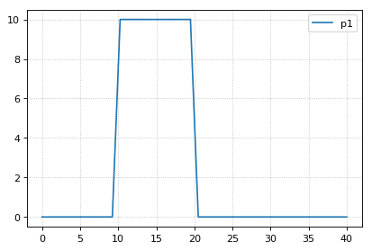
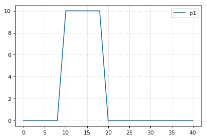
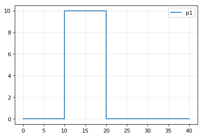
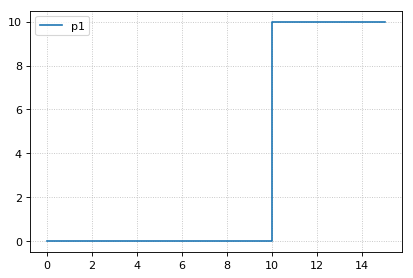

Simulating Models
~~~~~~~~~~~~~~~~~

Antimony models can be converted into a ``RoadRunner`` instance, which
can be used to simulate the model. The function ``loada`` converts
Antimony into a simulator instance. This example shows how to get the
Antimony / SBML representation of the current state of the model. After
running a simulation, the concentraions of the state variables will
change. You can retrieve the Antimony representation of the current
state of the model using ``getCurrentAntimony`` on the ``RoadRunner``
instance. This example shows the change in the Antimony / SBML
representation. The example also shows how to use variable stepping in a
simulation.

.. code-block:: python

    import tellurium as te
    
    print('-' * 80)
    te.printVersionInfo()
    print('-' * 80)
    
    r = te.loada('''
    model example
        p1 = 0;
        at time>=10: p1=10;
        at time>=20: p1=0;
    end
    ''')
    
    # convert current state of model back to Antimony / SBML
    ant_str_before = r.getCurrentAntimony()
    sbml_str_before = r.getCurrentSBML()
    # r.exportToSBML('/path/to/test.xml')
    
    # set selections
    r.selections=['time', 'p1']
    r.integrator.setValue("variable_step_size", False)
    r.resetAll()
    s1 = r.simulate(0, 40, 40)
    r.plot()
    # hitting the trigger point directly works
    r.resetAll()
    s2 = r.simulate(0, 40, 21)
    r.plot()
    
    # variable step size also does not work
    r.integrator.setValue("variable_step_size", True)
    r.resetAll()
    s3 = r.simulate(0, 40)
    r.plot()
    
    
    # convert current state of model back to Antimony / SBML
    ant_str_after = r.getCurrentAntimony()
    sbml_str_after = r.getCurrentSBML()
    
    import difflib
    print("Comparing Antimony at time 0 & 40 (expect no differences)")
    print('\n'.join(list(difflib.unified_diff(ant_str_before.splitlines(), ant_str_after.splitlines(), fromfile="before.sb", tofile="after.sb"))))
    
    # now simulate up to time 15
    r.resetAll()
    s4 = r.simulate(0, 15)
    r.plot()
    
    
    # convert current state of model back to Antimony / SBML
    ant_str_after2 = r.getCurrentAntimony()
    sbml_str_after2 = r.getCurrentSBML()
    
    print("Comparing Antimony at time 0 & 15")
    print('\n'.join(list(difflib.unified_diff(ant_str_before.splitlines(), ant_str_after2.splitlines(), fromfile="before.sb", tofile="after.sb"))))

.. parsed-literal::

    --------------------------------------------------------------------------------
    tellurium : 2.1.0
    roadrunner : 1.4.24
    antimony : 2.9.4
    libsbml : 5.15.0
    libsedml : 0.4.3
    phrasedml : 1.0.9
    --------------------------------------------------------------------------------

.. parsed-literal::

    Comparing Antimony at time 0 & 40 (expect no differences)
    

.. parsed-literal::

    Comparing Antimony at time 0 & 15
    --- before.sb
    
    +++ after.sb
    
    @@ -6,7 +6,7 @@
    
       _E1: at time >= 20: p1 = 0;
     
       // Variable initializations:
    -  p1 = 0;
    +  p1 = 10;
     
       // Other declarations:
       var p1;

.. code-block:: python

    r.getSimulationData()

.. parsed-literal::

               time, p1
     [[           0,  0],
      [ 0.000514839,  0],
      [      5.1489,  0],
      [          10,  0],
      [          10, 10],
      [     10.0002, 10],
      [     12.2588, 10],
      [          15, 10]]

