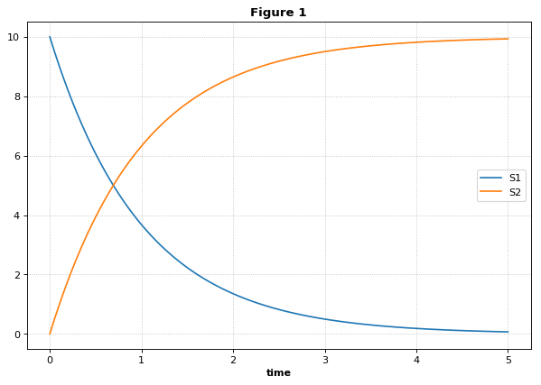

Combine archives
~~~~~~~~~~~~~~~~

The experiment, i.e. model with the simulation description, can be
stored as Combine Archive.

.. code:: ipython2

    import tellurium as te, tempfile, os
    te.setDefaultPlottingEngine('matplotlib')
    
    
    antimony_str = '''
    model myModel
      S1 -> S2; k1*S1
      S1 = 10; S2 = 0
      k1 = 1
    end
    '''
    
    phrasedml_str = '''
      model1 = model "myModel"
      sim1 = simulate uniform(0, 5, 100)
      task1 = run sim1 on model1
      plot "Figure 1" time vs S1, S2
    '''
    
    # create an inline OMEX (inline representation of a COMBINE archive)
    # from the antimony and phrasedml strings
    inline_omex = '\n'.join([antimony_str, phrasedml_str])
    
    # execute the inline OMEX
    te.executeInlineOmex(inline_omex)
    # export to a COMBINE archive
    workingDir = tempfile.mkdtemp(suffix="_omex")
    te.exportInlineOmex(inline_omex, os.path.join(workingDir, 'archive.omex'))

.. code:: ipython2

    te.executeCombineArchive(os.path.join(workingDir, 'archive.omex'))

.. parsed-literal::

    {'/tmp/tmpuso70njf/main.xml': {'code': 'r"""\n####################################################################################################\n                            tellurium 2.1.0\n-+++++++++++++++++-         Python Environment for Modeling and Simulating Biological Systems\n .+++++++++++++++.\n  .+++++++++++++.           Homepage:      http://tellurium.analogmachine.org/\n-//++++++++++++/.   -:/-`   Documentation: https://tellurium.readthedocs.io/en/latest/index.html\n.----:+++++++/.++  .++++/   Forum:         https://groups.google.com/forum/#!forum/tellurium-discuss\n      :+++++:  .+:` .--++   Bug reports:   https://github.com/sys-bio/tellurium/issues\n       -+++-    ./+:-://.   Repository:    https://github.com/sys-bio/tellurium\n        .+.       `...`\n\nSED-ML simulation experiments: http://www.sed-ml.org/\n    sedmlDoc: L1V2  \n    inputType:      \'SEDML_FILE\'\n    workingDir:     \'/tmp/tmpuso70njf\'\n    saveOutputs:    \'False\'\n    outputDir:      \'None\'\n    plottingEngine: \'<MatplotlibEngine>\'\n\nLinux-4.1.7-200.fc22.x86_64-x86_64-with-fedora-22-Twenty_Two\npython 3.6.3 (default, Oct 25 2017, 01:09:07) \n[GCC 4.8.2 20140120 (Red Hat 4.8.2-15)]\n####################################################################################################\n"""\nimport tellurium as te\nfrom roadrunner import Config\nfrom tellurium.sedml.mathml import *\nfrom tellurium.sedml.tesedml import process_trace, terminate_trace, fix_endpoints\n\nimport numpy as np\nimport matplotlib.pyplot as plt\nimport mpl_toolkits.mplot3d\ntry:\n    import tesedml as libsedml\nexcept ImportError:\n    import libsedml\nimport pandas\nimport os.path\nConfig.LOADSBMLOPTIONS_RECOMPILE = True\n\nworkingDir = r\'/tmp/tmpuso70njf\'\n\n# --------------------------------------------------------\n# Models\n# --------------------------------------------------------\n# Model <model1>\nmodel1 = te.loadSBMLModel(os.path.join(workingDir, \'myModel.xml\'))\n\n\n\n\n# --------------------------------------------------------\n# Tasks\n# --------------------------------------------------------\n# Task <task1>\n# Task: <task1>\ntask1 = [None]\nmodel1.setIntegrator(\'cvode\')\nif model1.conservedMoietyAnalysis == True: model1.conservedMoietyAnalysis = False\nmodel1.timeCourseSelections = [\'time\', \'[S1]\', \'[S2]\']\nmodel1.reset()\ntask1[0] = model1.simulate(start=0.0, end=5.0, steps=100)\n\n# --------------------------------------------------------\n# DataGenerators\n# --------------------------------------------------------\n# DataGenerator <plot_0_0_0>\n__var__time = np.concatenate([sim[\'time\'] for sim in task1])\nif len(__var__time.shape) == 1:\n     __var__time.shape += (1,)\nplot_0_0_0 = __var__time\n# DataGenerator <plot_0_0_1>\n__var__S1 = np.concatenate([sim[\'[S1]\'] for sim in task1])\nif len(__var__S1.shape) == 1:\n     __var__S1.shape += (1,)\nplot_0_0_1 = __var__S1\n# DataGenerator <plot_0_1_1>\n__var__S2 = np.concatenate([sim[\'[S2]\'] for sim in task1])\nif len(__var__S2.shape) == 1:\n     __var__S2.shape += (1,)\nplot_0_1_1 = __var__S2\n\n# --------------------------------------------------------\n# Outputs\n# --------------------------------------------------------\n# Output <plot_0>\n_stacked = False\nif _stacked:\n    tefig = te.getPlottingEngine().newStackedFigure(title=\'Figure 1\', xtitle=\'time\')\nelse:\n    tefig = te.nextFigure(title=\'Figure 1\', xtitle=\'time\')\n\nfor k in range(plot_0_0_0.shape[1]):\n    extra_args = {}\n    if k == 0:\n        extra_args[\'name\'] = \'S1\'\n    tefig.addXYDataset(plot_0_0_0[:,k], plot_0_0_1[:,k], color=\'C0\', tag=\'tag0\', logx=False, logy=False, **extra_args)\nfor k in range(plot_0_0_0.shape[1]):\n    extra_args = {}\n    if k == 0:\n        extra_args[\'name\'] = \'S2\'\n    tefig.addXYDataset(plot_0_0_0[:,k], plot_0_1_1[:,k], color=\'C1\', tag=\'tag1\', logx=False, logy=False, **extra_args)\nif te.tiledFigure():\n\n    if te.tiledFigure().renderIfExhausted():\n\n        te.clearTiledFigure()\n\nelse:\n\n    fig = tefig.render()\n\n####################################################################################################',
      'dataGenerators': {'plot_0_0_0': array([[0.  ],
              [0.05],
              [0.1 ],
              [0.15],
              [0.2 ],
              [0.25],
              [0.3 ],
              [0.35],
              [0.4 ],
              [0.45],
              [0.5 ],
              [0.55],
              [0.6 ],
              [0.65],
              [0.7 ],
              [0.75],
              [0.8 ],
              [0.85],
              [0.9 ],
              [0.95],
              [1.  ],
              [1.05],
              [1.1 ],
              [1.15],
              [1.2 ],
              [1.25],
              [1.3 ],
              [1.35],
              [1.4 ],
              [1.45],
              [1.5 ],
              [1.55],
              [1.6 ],
              [1.65],
              [1.7 ],
              [1.75],
              [1.8 ],
              [1.85],
              [1.9 ],
              [1.95],
              [2.  ],
              [2.05],
              [2.1 ],
              [2.15],
              [2.2 ],
              [2.25],
              [2.3 ],
              [2.35],
              [2.4 ],
              [2.45],
              [2.5 ],
              [2.55],
              [2.6 ],
              [2.65],
              [2.7 ],
              [2.75],
              [2.8 ],
              [2.85],
              [2.9 ],
              [2.95],
              [3.  ],
              [3.05],
              [3.1 ],
              [3.15],
              [3.2 ],
              [3.25],
              [3.3 ],
              [3.35],
              [3.4 ],
              [3.45],
              [3.5 ],
              [3.55],
              [3.6 ],
              [3.65],
              [3.7 ],
              [3.75],
              [3.8 ],
              [3.85],
              [3.9 ],
              [3.95],
              [4.  ],
              [4.05],
              [4.1 ],
              [4.15],
              [4.2 ],
              [4.25],
              [4.3 ],
              [4.35],
              [4.4 ],
              [4.45],
              [4.5 ],
              [4.55],
              [4.6 ],
              [4.65],
              [4.7 ],
              [4.75],
              [4.8 ],
              [4.85],
              [4.9 ],
              [4.95],
              [5.  ]]), 'plot_0_0_1': array([[10.        ],
              [ 9.51229478],
              [ 9.04837601],
              [ 8.60708133],
              [ 8.1873084 ],
              [ 7.78800677],
              [ 7.40817715],
              [ 7.04687053],
              [ 6.70318432],
              [ 6.37626316],
              [ 6.06528894],
              [ 5.76948224],
              [ 5.48810228],
              [ 5.2204444 ],
              [ 4.96583988],
              [ 4.72365261],
              [ 4.49327726],
              [ 4.27413784],
              [ 4.06568595],
              [ 3.86740024],
              [ 3.6787849 ],
              [ 3.49936821],
              [ 3.3287018 ],
              [ 3.16635886],
              [ 3.0119336 ],
              [ 2.86503997],
              [ 2.7253105 ],
              [ 2.59239692],
              [ 2.46596695],
              [ 2.34570353],
              [ 2.231304  ],
              [ 2.12248435],
              [ 2.01897085],
              [ 1.92050481],
              [ 1.82684058],
              [ 1.73774427],
              [ 1.65299308],
              [ 1.57237551],
              [ 1.4956901 ],
              [ 1.42274479],
              [ 1.35335743],
              [ 1.28735442],
              [ 1.22457002],
              [ 1.16484805],
              [ 1.10803845],
              [ 1.05399922],
              [ 1.00259553],
              [ 0.95369856],
              [ 0.90718638],
              [ 0.86294256],
              [ 0.82085652],
              [ 0.78082318],
              [ 0.74274217],
              [ 0.70651858],
              [ 0.67206162],
              [ 0.63928502],
              [ 0.60810708],
              [ 0.57844956],
              [ 0.55023846],
              [ 0.52340323],
              [ 0.49787667],
              [ 0.47359512],
              [ 0.45049774],
              [ 0.42852684],
              [ 0.40762751],
              [ 0.38774739],
              [ 0.36883691],
              [ 0.35084867],
              [ 0.3337377 ],
              [ 0.31746128],
              [ 0.30197859],
              [ 0.28725105],
              [ 0.27324176],
              [ 0.25991567],
              [ 0.24723954],
              [ 0.23518159],
              [ 0.22371174],
              [ 0.21280128],
              [ 0.2024229 ],
              [ 0.19255071],
              [ 0.18315996],
              [ 0.17422721],
              [ 0.16573013],
              [ 0.15764742],
              [ 0.14995893],
              [ 0.1426454 ],
              [ 0.13568854],
              [ 0.12907099],
              [ 0.12277616],
              [ 0.11678835],
              [ 0.11109256],
              [ 0.10567454],
              [ 0.10052078],
              [ 0.09561835],
              [ 0.09095503],
              [ 0.08651914],
              [ 0.08229957],
              [ 0.07828581],
              [ 0.07446779],
              [ 0.07083598],
              [ 0.0673813 ]]), 'plot_0_1_1': array([[0.        ],
              [0.48770522],
              [0.95162399],
              [1.39291867],
              [1.8126916 ],
              [2.21199323],
              [2.59182285],
              [2.95312947],
              [3.29681568],
              [3.62373684],
              [3.93471106],
              [4.23051776],
              [4.51189772],
              [4.7795556 ],
              [5.03416012],
              [5.27634739],
              [5.50672274],
              [5.72586216],
              [5.93431405],
              [6.13259976],
              [6.3212151 ],
              [6.50063179],
              [6.6712982 ],
              [6.83364114],
              [6.9880664 ],
              [7.13496003],
              [7.2746895 ],
              [7.40760308],
              [7.53403305],
              [7.65429647],
              [7.768696  ],
              [7.87751565],
              [7.98102915],
              [8.07949519],
              [8.17315942],
              [8.26225573],
              [8.34700692],
              [8.42762449],
              [8.5043099 ],
              [8.57725521],
              [8.64664257],
              [8.71264558],
              [8.77542998],
              [8.83515195],
              [8.89196155],
              [8.94600078],
              [8.99740447],
              [9.04630144],
              [9.09281362],
              [9.13705744],
              [9.17914348],
              [9.21917682],
              [9.25725783],
              [9.29348142],
              [9.32793838],
              [9.36071498],
              [9.39189292],
              [9.42155044],
              [9.44976154],
              [9.47659677],
              [9.50212333],
              [9.52640488],
              [9.54950226],
              [9.57147316],
              [9.59237249],
              [9.61225261],
              [9.63116309],
              [9.64915133],
              [9.6662623 ],
              [9.68253872],
              [9.69802141],
              [9.71274895],
              [9.72675824],
              [9.74008433],
              [9.75276046],
              [9.76481841],
              [9.77628826],
              [9.78719872],
              [9.7975771 ],
              [9.80744929],
              [9.81684004],
              [9.82577279],
              [9.83426987],
              [9.84235258],
              [9.85004107],
              [9.8573546 ],
              [9.86431146],
              [9.87092901],
              [9.87722384],
              [9.88321165],
              [9.88890744],
              [9.89432546],
              [9.89947922],
              [9.90438165],
              [9.90904497],
              [9.91348086],
              [9.91770043],
              [9.92171419],
              [9.92553221],
              [9.92916402],
              [9.9326187 ]])},
      'platform': 'Linux-4.1.7-200.fc22.x86_64-x86_64-with-fedora-22-Twenty_Two'}}

