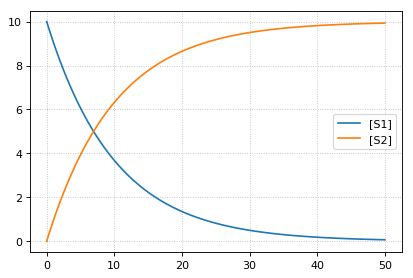
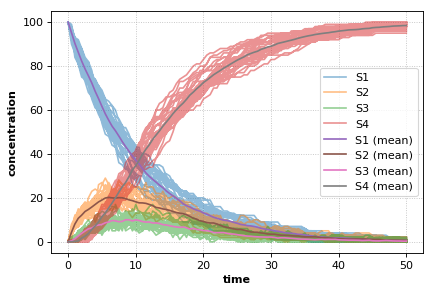

Simple Example
--------------

This shows how to set up a simple model in Tellurium and solve it as an
ODE. Tellurium uses a human-readable representation of SBML models
called Antimony. The Antimony code for this example contains a single
reaction with associated kinetics. After creating the Antimony string,
use the ``loada`` function to load it into the
`RoadRunner <http://sys-bio.github.io/roadrunner/python_docs/index.html>`__
simulator. A
`RoadRunner <http://sys-bio.github.io/roadrunner/python_docs/index.html>`__
instance has a method
`simulate <http://sys-bio.github.io/roadrunner/python_docs/using_roadrunner.html#running-simulations>`__
that can be used to run timecourse simulations of a model, as shown
below.

.. code-block:: python

    import tellurium as te
    r = te.loada('S1 -> S2; k1*S1; k1 = 0.1; S1 = 10')
    r.simulate(0, 50, 100)
    r.plot()

More Complex Example
--------------------

Tellurium can also handle stochastic models. This example shows how to
select Tellurium's stochastic solver. The underlying simulation engine
used by Tellurium implements a Gibson direct method for simulating this
model.

.. code-block:: python

    import tellurium as te
    import numpy as np
    
    r = te.loada('''
        J1: S1 -> S2;  k1*S1; 
        J2: S2 -> S3; k2*S2 - k3*S3
        # J2_1: S2 -> S3; k2*S2
        # J2_2: S3 -> S2; k3*S3;
        J3: S3 -> S4; k4*S3;
    
        k1 = 0.1; k2 = 0.5; k3 = 0.5; k4 = 0.5;
        S1 = 100;
    ''')
    
    # use a stochastic solver
    r.integrator = 'gillespie'
    r.integrator.seed = 1234
    # selections specifies the output variables in a simulation
    selections = ['time'] + r.getBoundarySpeciesIds() + r.getFloatingSpeciesIds()
    r.integrator.variable_step_size = False
    
    # run repeated simulation
    Ncol = len(r.selections)
    Nsim = 30
    points = 101
    s_sum = np.zeros(shape=[points, Ncol])
    for k in range(Nsim):
        r.resetToOrigin()
        s = r.simulate(0, 50, points, selections=selections)
        s_sum += s
        # use show=False to add traces to the current plot
        # instead of starting a new one, equivalent to MATLAB hold on
        r.plot(s, alpha=0.5, show=False)
    
    # add mean curve, legend, show everything and set labels, titels, ...
    fig = te.plot(s[:,0], s_sum[:,1:]/Nsim, names=[x + ' (mean)' for x in selections[1:]], title="Stochastic simulation", xtitle="time", ytitle="concentration")

