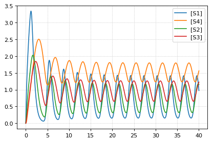
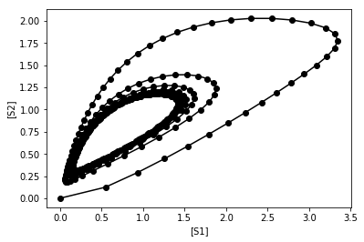

Feedback oscillations
~~~~~~~~~~~~~~~~~~~~~

Model oscillations via feedback

.. code-block:: python

    import tellurium as te
    
    r = te.loada ('''
    model feedback()
       // Reactions:
       J0: $X0 -> S1; (VM1 * (X0 - S1/Keq1))/(1 + X0 + S1 + S4^h);
       J1: S1 -> S2; (10 * S1 - 2 * S2) / (1 + S1 + S2);
       J2: S2 -> S3; (10 * S2 - 2 * S3) / (1 + S2 + S3);
       J3: S3 -> S4; (10 * S3 - 2 * S4) / (1 + S3 + S4);
       J4: S4 -> $X1; (V4 * S4) / (KS4 + S4);
    
      // Species initializations:
      S1 = 0; S2 = 0; S3 = 0;
      S4 = 0; X0 = 10; X1 = 0;
    
      // Variable initialization:
      VM1 = 10; Keq1 = 10; h = 10; V4 = 2.5; KS4 = 0.5;
    end''')
    
    res = r.simulate(0, 40, 500)
    r.plot()
    
    import matplotlib.pylab as plt
    plt.plot(res["[S1]"], res["[S2]"], 'o-', color="black")
    plt.xlabel("[S1]")
    plt.ylabel("[S2]");

