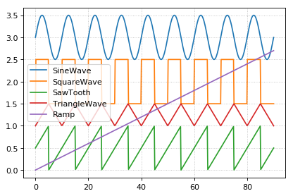

Generate different wave forms
~~~~~~~~~~~~~~~~~~~~~~~~~~~~~

Example for how to create different wave form functions in tellurium.

.. code-block:: python

    import tellurium as te
    from roadrunner import Config
    
    # We do not want CONSERVED MOIETIES set to true in this case
    Config.setValue(Config.LOADSBMLOPTIONS_CONSERVED_MOIETIES, False) 
    
    # Generating different waveforms
    model = '''
      model waveforms()
         # All waves have the following amplitude and period
         amplitude = 1
         period = 10
    
         # These events set the 'UpDown' variable to 1 or 0 according to the period.
         UpDown=0
         at sin(2*pi*time/period) >  0, t0=false: UpDown = 1
         at sin(2*pi*time/period) <= 0, t0=false: UpDown = 0
    
         # Simple Sine wave with y displaced by 3
         SineWave := amplitude/2*sin(2*pi*time/period) + 3
    
         # Square wave with y displaced by 1.5
         SquareWave := amplitude*UpDown + 1.5
    
         # Triangle waveform with given period and y displaced by 1
         TriangleWave = 1
         TriangleWave' = amplitude*2*(UpDown - 0.5)/period
    
         # Saw tooth wave form with given period
         SawTooth = amplitude/2
         SawTooth' = amplitude/period
         at UpDown==0: SawTooth = 0
    
         # Simple ramp
         Ramp := 0.03*time
      end
    '''
    
    r = te.loada(model)
    
    r.timeCourseSelections = ['time', 'SineWave', 'SquareWave', 'SawTooth', 'TriangleWave', 'Ramp']
    result = r.simulate (0, 90, 500)
    r.plot(result)
    
    # reset to default config
    Config.setValue(Config.LOADSBMLOPTIONS_CONSERVED_MOIETIES, False) 

