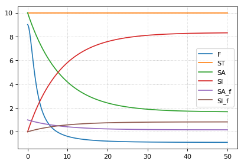

Normalized species
~~~~~~~~~~~~~~~~~~

Example model which calculates functions depending on the normalized
values of a species which can be either in active state ``SA`` or
inactive state ``SI``.

The normalized values are ``SA_f`` and ``SI_f``, respectively, with the
total concentration of ``S`` given as

::

    ST = SA + SI

Model definition
^^^^^^^^^^^^^^^^

The model is defined using ``Tellurium`` and ``Antimony``. The identical
equations could be typed directly in ``COPASI``.

The created model is exported as ``SBML`` which than can be used in
``COPASI``.

.. code-block:: python

    import tellurium as te
    r = te.loada("""
        model normalized_species()
        
        # conversion between active (SA) and inactive (SI)
        J1: SA -> SI; k1*SA - k2*SI;
        k1 = 0.1; k2 = 0.02;
        
        # species
        species SA, SI, ST;
        SA = 10.0; SI = 0.0;
        const ST := SA + SI;
        
        SA is "active state S";
        SI is "inactive state S";
        ST is "total state S";
        
        # normalized species calculated via assignment rules
        species SA_f, SI_f;
        SA_f := SA/ST;
        SI_f := SI/ST;
        
        SA_f is "normalized active state S";
        SI_f is "normalized inactive state S";
        
        # parameters for your function
        P = 0.1;
        tau = 10.0;
        nA = 1.0;
        nI = 2.0;
        kA = 0.1;
        kI = 0.2;
        # now just use the normalized species in some math
        F := ( (1-(SI_f^nI)/(kI^nI+SI_f^nI)*(kI^nI+1) ) * ( (SA_f^nA)/(kA^nA+SA_f^nA)*(kA^nA+1) ) -P)*tau;
    
        end
    """)
    # print(r.getAntimony())
    
    # Store the SBML for COPASI
    import os
    import tempfile
    temp_dir = tempfile.mkdtemp()
    file_path = os.path.join(temp_dir, 'normalizedSpecies.xml')
    r.exportToSBML(file_path)

Model simulation
^^^^^^^^^^^^^^^^

We perform a simple model simulation to demonstrate the main features
using ``roadrunner``: - normalized values ``SA_f`` and ``SI_f`` are
normalized in ``[0,1]`` - the normalized values have same dynamics like
``SA`` and ``SF`` - the normalized values can be used to calculates some
dependent function, here ``F``

.. code-block:: python

    r.reset()
    # select the variables of interest in output
    r.selections = ['time', 'F'] + r.getBoundarySpeciesIds() \
                                 + r.getFloatingSpeciesIds()
    # simulate from 0 to 50 with 1001 points
    s = r.simulate(0,50,1001)
    # plot the results
    r.plot(s);

