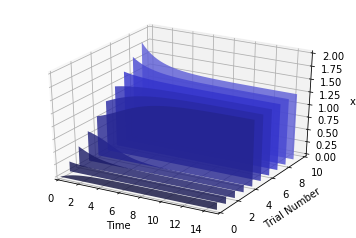
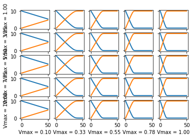

``plotPolyArray()`` example

.. code:: ipython2

    import tellurium as te
    
    r = te.loada('''
        J1: $Xo -> x; 0.1 + k1*x^4/(k2+x^4);
        x -> $w; k3*x;
    
        k1 = 0.9;
        k2 = 0.3;
        k3 = 0.7;
        x = 0;
    ''')
    
    # parameter scan
    p = te.ParameterScan(r,
        # settings
        startTime = 0,
        endTime = 15,
        numberOfPoints = 50,
        polyNumber = 10,
        endValue = 1.8,
        alpha = 0.8,
        value = "x",
        selection = "x",
        color = ['#0F0F3D', '#141452', '#1A1A66', '#1F1F7A', '#24248F', '#2929A3',
                   '#2E2EB8', '#3333CC', '#4747D1', '#5C5CD6']                    
    )
    # plot
    p.plotPolyArray()

``plotSurface()`` example

.. code:: ipython2

    r = te.loada('''
        $Xo -> S1; vo;
        S1 -> S2; k1*S1 - k2*S2;
        S2 -> $X1; k3*S2;
        
        vo = 1
        k1 = 2; k2 = 0; k3 = 3;
    ''')
    
    # parameter scan
    p = te.ParameterScan(r,
        # settings
        startTime = 0,
        endTime = 6,
        numberOfPoints = 50,
        startValue = 1,
        endValue = 5,
        colormap = "cool",
        independent = ["Time", "k1"],
        dependent = "S1",
        xlabel = "Time",
        ylabel = "x",
        title = "Model"                                  
    )
    # plot
    p.plotSurface()

.. image:: _notebooks/core/parameter_scan_files/parameter_scan_3_0.png

``plot2DParameterScan()`` example

.. code-block:: python

    import warnings
    warnings.filterwarnings("ignore")
    
    import tellurium as te
    from tellurium.analysis.parameterscan import plot2DParameterScan
    
    # model definitions
    r = te.loada("""
    model test
       J0: S1 -> S2; Vmax * (S1/(Km+S1))
        S1 = 10; S2 = 0;
        Vmax = 1; Km = 0.5;
    end
    """)
    s = r.simulate(0, 20, 41)
    r.plot(s)
    
    import numpy as np
    plot2DParameterScan(r,
                        p1='Vmax', p1Range=np.linspace(1, 10, num=5),
                        p2='Vmax', p2Range=np.linspace(0.1, 1.0, num=5),
                        start=0, end=50, points=101)

.. image:: _notebooks/core/plot2DParameterScan_files/plot2DParameterScan_0_0.png

