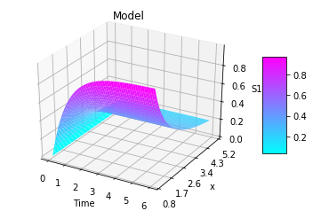

Parameter scan
~~~~~~~~~~~~~~

Perform a parameter scan.

.. code:: ipython2

    import tellurium as te
    
    r = te.loada('''
        J1: $Xo -> x; 0.1 + k1*x^4/(k2+x^4);
        x -> $w; k3*x;
    
        k1 = 0.9;
        k2 = 0.3;
        k3 = 0.7;
        x = 0;
    ''')
    
    # parameter scan
    p = te.ParameterScan(r,
        # settings
        startTime = 0,
        endTime = 15,
        numberOfPoints = 50,
        polyNumber = 10,
        endValue = 1.8,
        alpha = 0.8,
        value = "x",
        selection = "x",
        color = ['#0F0F3D', '#141452', '#1A1A66', '#1F1F7A', '#24248F', '#2929A3',
                   '#2E2EB8', '#3333CC', '#4747D1', '#5C5CD6']                    
    )
    # plot
    p.plotPolyArray()

::

    ---------------------------------------------------------------------------

    TypeError                                 Traceback (most recent call last)

    <ipython-input-1-f092f852a16c> in <module>()
         28 )
         29 # plot
    ---> 30 p.plotPolyArray()
    

    /extra/devel/src/tellurium/tellurium/analysis/parameterscan.py in plotPolyArray(self)
        349 
        350         if not IPYTHON:
    --> 351             self.plotPolyArrayFunction(result)
        352             return result
        353         else:

    /extra/devel/src/tellurium/tellurium/analysis/parameterscan.py in plotPolyArrayFunction(self, result)
        301             if len(self.color) != self.polyNumber:
        302                 self.color = self.colorCycle()
    --> 303             poly = PolyCollection(result, facecolors=self.color, closed=False)
        304 
        305         poly.set_alpha(self.alpha)

    ~/.config/Tellurium/telocal/python-3.6.3/lib/python3.6/site-packages/matplotlib/collections.py in __init__(self, verts, sizes, closed, **kwargs)
        961         Collection.__init__(self, **kwargs)
        962         self.set_sizes(sizes)
    --> 963         self.set_verts(verts, closed)
        964         self.stale = True
        965 

    ~/.config/Tellurium/telocal/python-3.6.3/lib/python3.6/site-packages/matplotlib/collections.py in set_verts(self, verts, closed)
        986                     self._paths.append(mpath.Path(xy))
        987         else:
    --> 988             self._paths = [mpath.Path(xy) for xy in verts]
        989         self.stale = True
        990 

    ~/.config/Tellurium/telocal/python-3.6.3/lib/python3.6/site-packages/matplotlib/collections.py in <listcomp>(.0)
        986                     self._paths.append(mpath.Path(xy))
        987         else:
    --> 988             self._paths = [mpath.Path(xy) for xy in verts]
        989         self.stale = True
        990 

    ~/.config/Tellurium/telocal/python-3.6.3/lib/python3.6/site-packages/matplotlib/path.py in __init__(self, vertices, codes, _interpolation_steps, closed, readonly)
        130             and codes as read-only arrays.
        131         """
    --> 132         vertices = _to_unmasked_float_array(vertices)
        133         if (vertices.ndim != 2) or (vertices.shape[1] != 2):
        134             raise ValueError(

    ~/.config/Tellurium/telocal/python-3.6.3/lib/python3.6/site-packages/matplotlib/cbook/__init__.py in _to_unmasked_float_array(x)
       2048         return np.ma.asarray(x, float).filled(np.nan)
       2049     else:
    -> 2050         return np.asarray(x, float)
       2051 
       2052 

    ~/.config/Tellurium/telocal/python-3.6.3/lib/python3.6/site-packages/numpy/core/numeric.py in asarray(a, dtype, order)
        490 
        491     """
    --> 492     return array(a, dtype, copy=False, order=order)
        493 
        494 

    TypeError: float() argument must be a string or a number, not 'zip'

.. image:: _notebooks/core/parameter_scan_files/parameter_scan_2_1.png

.. code:: ipython2

    r = te.loada('''
        $Xo -> S1; vo;
        S1 -> S2; k1*S1 - k2*S2;
        S2 -> $X1; k3*S2;
        
        vo = 1
        k1 = 2; k2 = 0; k3 = 3;
    ''')
    
    # parameter scan
    p = te.ParameterScan(r,
        # settings
        startTime = 0,
        endTime = 6,
        numberOfPoints = 50,
        startValue = 1,
        endValue = 5,
        colormap = "cool",
        independent = ["Time", "k1"],
        dependent = "S1",
        xlabel = "Time",
        ylabel = "x",
        title = "Model"                                  
    )
    # plot
    p.plotSurface()

