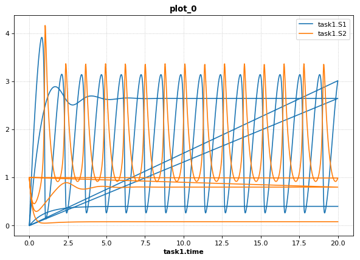
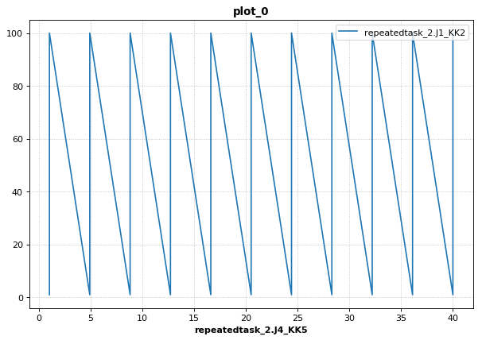
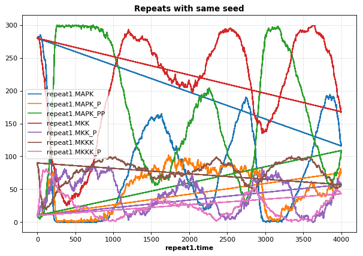
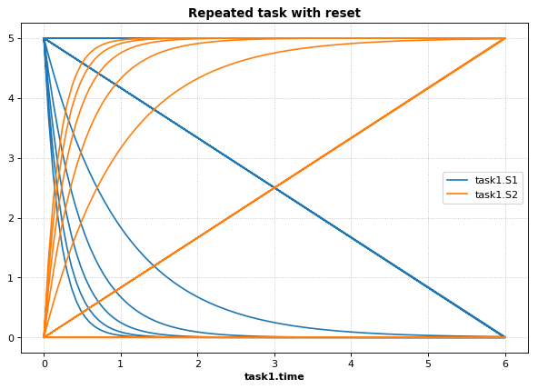
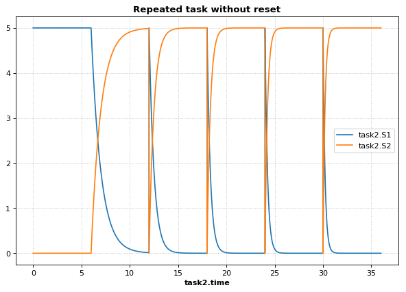
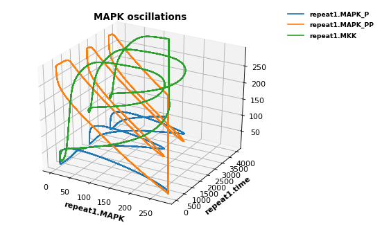

SED-ML L1V2 specification example
~~~~~~~~~~~~~~~~~~~~~~~~~~~~~~~~~

Repressilator example which demonstrates the use of phrasedml with URN
examples.

These examples are the reference examples from the SED-ML specification
document available from
http://sed-ml.sourceforge.net/documents/sed-ml-L1V2.pdf (Introduction
Section).

.. code-block:: python

    import tellurium as te, tellurium.temiriam as temiriam
    te.setDefaultPlottingEngine('matplotlib')
    import phrasedml
    
    # Get SBML from URN and set for phrasedml
    urn = "urn:miriam:biomodels.db:BIOMD0000000012"
    sbmlStr = temiriam.getSBMLFromBiomodelsURN(urn=urn)
    phrasedml.setReferencedSBML('BIOMD0000000012', sbmlStr)
    
    # <SBML species>
    #   PX - LacI protein
    #   PY - TetR protein
    #   PZ - cI protein
    #   X - LacI mRNA
    #   Y - TetR mRNA
    #   Z - cI mRNA
    
    # <SBML parameters>
    #   ps_a - tps_active: Transcrition from free promotor in transcripts per second and promotor
    #   ps_0 - tps_repr: Transcrition from fully repressed promotor in transcripts per second and promotor
    
    phrasedmlStr = """
        model1 = model "{}"
        model2 = model model1 with ps_0=1.3E-5, ps_a=0.013
        sim1 = simulate uniform(0, 1000, 1000)
        task1 = run sim1 on model1
        task2 = run sim1 on model2
    
        # A simple timecourse simulation
        plot "Figure 1.1 Timecourse of repressilator" task1.time vs task1.PX, task1.PZ, task1.PY
    
        # Applying preprocessing
        plot "Figure 1.2 Timecourse after pre-processing" task2.time vs task2.PX, task2.PZ, task2.PY
    
        # Applying postprocessing
        plot "Figure 1.3 Timecourse after post-processing" task1.PX/max(task1.PX) vs task1.PZ/max(task1.PZ), \
                                                           task1.PY/max(task1.PY) vs task1.PX/max(task1.PX), \
                                                           task1.PZ/max(task1.PZ) vs task1.PY/max(task1.PY)
    """.format('BIOMD0000000012')
    
    # convert to SED-ML
    sedmlStr = phrasedml.convertString(phrasedmlStr)
    if sedmlStr == None:
        raise RuntimeError(phrasedml.getLastError())
    
    # Run the SED-ML file with results written in workingDir
    import tempfile, shutil, os
    workingDir = tempfile.mkdtemp(suffix="_sedml")
    # write out SBML
    with open(os.path.join(workingDir, 'BIOMD0000000012'), 'wb') as f:
        f.write(sbmlStr.encode('utf-8'))
    te.executeSEDML(sedmlStr, workingDir=workingDir)
    shutil.rmtree(workingDir)

.. raw:: html

    

.. parsed-literal::

    INFO:root:Initialising BioModels service (WSDL)

.. image:: _notebooks/core/phrasedmlExample_files/phrasedmlExample_2_2.png

.. image:: _notebooks/core/phrasedmlExample_files/phrasedmlExample_2_3.png

.. image:: _notebooks/core/phrasedmlExample_files/phrasedmlExample_2_4.png

Execute SED-ML Archive
~~~~~~~~~~~~~~~~~~~~~~

Tellurium can read and execute the SED-ML from a SED-ML archive. This is
**not** the same as a COMBINE archive (see below for COMBINE archive
examples).

.. code-block:: python

    import tellurium as te
    from tellurium.tests.testdata import sedxDir
    import os
    omexPath = os.path.join(sedxDir, "BIOMD0000000003.sedx")
    print('Loading SED-ML archive from path: {}'.format(omexPath))
    print('Using {} as a working directory'.format(os.path.join(os.path.split(omexPath)[0], '_te_BIOMD0000000003')))
    
    # execute the SED-ML archive
    te.executeSEDML(omexPath)

.. parsed-literal::

    Loading SED-ML archive from path: /home/poltergeist/devel/src/tellurium/tellurium/tests/testdata/sedml/sedx/BIOMD0000000003.sedx
    Using /home/poltergeist/devel/src/tellurium/tellurium/tests/testdata/sedml/sedx/_te_BIOMD0000000003 as a working directory

.. parsed-literal::

    /home/poltergeist/devel/src/tellurium/tellurium/tecombine.py:274: UserWarning:
    
    Combine archive directory already exists:/home/poltergeist/devel/src/tellurium/tellurium/tests/testdata/sedml/sedx/_te_BIOMD0000000003
    
    /home/poltergeist/devel/src/tellurium/tellurium/tecombine.py:329: UserWarning:
    
    No 'manifest.xml' in archive, trying to resolve manually
    

.. image:: _notebooks/core/phrasedmlExample_files/phrasedmlExample_4_2.png

Inline OMEX and COMBINE archives
~~~~~~~~~~~~~~~~~~~~~~~~~~~~~~~~

Tellurium provides a way to easily edit the contents of COMBINE archives
in a human-readable format called inline OMEX. To create a COMBINE
archive, simply create a string containing all models (in Antimony
format) and all simulations (in PhraSEDML format). Tellurium will
transparently convert the Antimony to SBML and PhraSEDML to SED-ML, then
execute the resulting SED-ML. The following example will work in either
Jupyter or the `Tellurium notebook
viewer <http://tellurium.readthedocs.io/en/latest/installation.html#front-end-1-tellurium-notebook>`__.
The Tellurium notebook viewer allows you to create specialized cells for
inline OMEX, which contain correct syntax-highlighting for the format.

.. code-block:: python

    import tellurium as te
    
    antimony_str = '''
    model myModel
      S1 -> S2; k1*S1
      S1 = 10; S2 = 0
      k1 = 1
    end
    '''
    
    phrasedml_str = '''
      model1 = model "myModel"
      sim1 = simulate uniform(0, 5, 100)
      task1 = run sim1 on model1
      plot "Figure 1" time vs S1, S2
    '''
    
    # create an inline OMEX (inline representation of a COMBINE archive)
    # from the antimony and phrasedml strings
    inline_omex = '\n'.join([antimony_str, phrasedml_str])
    
    # execute the inline OMEX
    te.executeInlineOmex(inline_omex)
    # export to a COMBINE archive
    workingDir = tempfile.mkdtemp(suffix="_omex")
    te.exportInlineOmex(inline_omex, os.path.join(workingDir, 'archive.omex'))

OneStep
~~~~~~~

Running a one step simulation.

.. code-block:: python

    import tellurium as te
    
    antimony_str = '''
    // Created by libAntimony v2.9
    model *oneStep()
    
    // Compartments and Species:
    compartment compartment_;
    species S1 in compartment_, S2 in compartment_, $X0 in compartment_, $X1 in compartment_;
    species $X2 in compartment_;
    
    // Reactions:
    J0: $X0 => S1; J0_v0;
    J1: S1 => $X1; J1_k3*S1;
    J2: S1 => S2; (J2_k1*S1 - J2_k_1*S2)*(1 + J2_c*S2^J2_q);
    J3: S2 => $X2; J3_k2*S2;
    
    // Species initializations:
    S1 = 0;
    S2 = 1;
    X0 = 1;
    X1 = 0;
    X2 = 0;
    
    // Compartment initializations:
    compartment_ = 1;
    
    // Variable initializations:
    J0_v0 = 8;
    J1_k3 = 0;
    J2_k1 = 1;
    J2_k_1 = 0;
    J2_c = 1;
    J2_q = 3;
    J3_k2 = 5;
    
    // Other declarations:
    const compartment_, J0_v0, J1_k3, J2_k1, J2_k_1, J2_c, J2_q, J3_k2;
    end
    '''
    
    phrasedml_str = '''
    model1 = model "oneStep"
    stepper = simulate onestep(0.1)
    task0 = run stepper on model1
    task1 = repeat task0 for local.x in uniform(0, 10, 100), J0_v0 = piecewise(8, x<4, 0.1, 4<=x<6, 8)
    plot "One Step Simulation" task1.time vs task1.S1, task1.S2, task1.J0_v0
    report task1.time vs task1.S1, task1.S2, task1.J0_v0
    '''
    
    # create the inline OMEX string
    inline_omex = '\n'.join([antimony_str, phrasedml_str])
    
    # export to a COMBINE archive
    workingDir = tempfile.mkdtemp(suffix="_omex")
    archive_name = os.path.join(workingDir, 'archive.omex')
    te.exportInlineOmex(inline_omex, archive_name)
    # convert the COMBINE archive back into an 
    # inline OMEX (transparently) and execute it
    te.convertAndExecuteCombineArchive(archive_name)

.. parsed-literal::

    --------------------------------------------------------------------------------
    report_1, Repeat: 0
    --------------------------------------------------------------------------------
       task1.time  task1.S1  task1.S2  task1.J0_v0
    0         0.0  0.000000  1.000000          8.0
    1         0.1  0.745536  0.652363          8.0
    2         0.1  0.745536  0.652363          8.0
    3         0.2  1.417842  0.498250          8.0
    4         0.2  1.417842  0.498250          8.0

1d Parameter Scan
~~~~~~~~~~~~~~~~~

This example shows how to perform a one-dimensional parameter scan using
Antimony/PhraSEDML and convert the study to a COMBINE archive. The
example uses a PhraSEDML repeated task ``task1`` to run a timecourse
simulation ``task0`` on a model for different values of the parameter
``J0_v0``.

.. code-block:: python

    import tellurium as te
    
    antimony_str = '''
    // Created by libAntimony v2.9
    model *parameterScan1D()
    
    // Compartments and Species:
    compartment compartment_;
    species S1 in compartment_, S2 in compartment_, $X0 in compartment_, $X1 in compartment_;
    species $X2 in compartment_;
    
    // Reactions:
    J0: $X0 => S1; J0_v0;
    J1: S1 => $X1; J1_k3*S1;
    J2: S1 => S2; (J2_k1*S1 - J2_k_1*S2)*(1 + J2_c*S2^J2_q);
    J3: S2 => $X2; J3_k2*S2;
    
    // Species initializations:
    S1 = 0;
    S2 = 1;
    X0 = 1;
    X1 = 0;
    X2 = 0;
    
    // Compartment initializations:
    compartment_ = 1;
    
    // Variable initializations:
    J0_v0 = 8;
    J1_k3 = 0;
    J2_k1 = 1;
    J2_k_1 = 0;
    J2_c = 1;
    J2_q = 3;
    J3_k2 = 5;
    
    // Other declarations:
    const compartment_, J0_v0, J1_k3, J2_k1, J2_k_1, J2_c, J2_q, J3_k2;
    end
    '''
    
    phrasedml_str = '''
    model1 = model "parameterScan1D"
    timecourse1 = simulate uniform(0, 20, 1000)
    task0 = run timecourse1 on model1
    task1 = repeat task0 for J0_v0 in [8, 4, 0.4], reset=true
    plot task1.time vs task1.S1, task1.S2
    '''
    
    # create the inline OMEX string
    inline_omex = '\n'.join([antimony_str, phrasedml_str])
    
    # execute the inline OMEX
    te.executeInlineOmex(inline_omex)

2d Parameter Scan
~~~~~~~~~~~~~~~~~

There are multiple was to specify the set of values that should be swept
over. This example uses two repeated tasks instead of one. It sweeps
through a discrete set of values for the parameter ``J1_KK2``, and then
sweeps through a uniform range for another parameter ``J4_KK5``.

.. code-block:: python

    import tellurium as te
    
    antimony_str = '''
    // Created by libAntimony v2.9
    model *parameterScan2D()
    
      // Compartments and Species:
      compartment compartment_;
      species MKKK in compartment_, MKKK_P in compartment_, MKK in compartment_;
      species MKK_P in compartment_, MKK_PP in compartment_, MAPK in compartment_;
      species MAPK_P in compartment_, MAPK_PP in compartment_;
    
      // Reactions:
      J0: MKKK => MKKK_P; (J0_V1*MKKK)/((1 + (MAPK_PP/J0_Ki)^J0_n)*(J0_K1 + MKKK));
      J1: MKKK_P => MKKK; (J1_V2*MKKK_P)/(J1_KK2 + MKKK_P);
      J2: MKK => MKK_P; (J2_k3*MKKK_P*MKK)/(J2_KK3 + MKK);
      J3: MKK_P => MKK_PP; (J3_k4*MKKK_P*MKK_P)/(J3_KK4 + MKK_P);
      J4: MKK_PP => MKK_P; (J4_V5*MKK_PP)/(J4_KK5 + MKK_PP);
      J5: MKK_P => MKK; (J5_V6*MKK_P)/(J5_KK6 + MKK_P);
      J6: MAPK => MAPK_P; (J6_k7*MKK_PP*MAPK)/(J6_KK7 + MAPK);
      J7: MAPK_P => MAPK_PP; (J7_k8*MKK_PP*MAPK_P)/(J7_KK8 + MAPK_P);
      J8: MAPK_PP => MAPK_P; (J8_V9*MAPK_PP)/(J8_KK9 + MAPK_PP);
      J9: MAPK_P => MAPK; (J9_V10*MAPK_P)/(J9_KK10 + MAPK_P);
    
      // Species initializations:
      MKKK = 90;
      MKKK_P = 10;
      MKK = 280;
      MKK_P = 10;
      MKK_PP = 10;
      MAPK = 280;
      MAPK_P = 10;
      MAPK_PP = 10;
    
      // Compartment initializations:
      compartment_ = 1;
    
      // Variable initializations:
      J0_V1 = 2.5;
      J0_Ki = 9;
      J0_n = 1;
      J0_K1 = 10;
      J1_V2 = 0.25;
      J1_KK2 = 8;
      J2_k3 = 0.025;
      J2_KK3 = 15;
      J3_k4 = 0.025;
      J3_KK4 = 15;
      J4_V5 = 0.75;
      J4_KK5 = 15;
      J5_V6 = 0.75;
      J5_KK6 = 15;
      J6_k7 = 0.025;
      J6_KK7 = 15;
      J7_k8 = 0.025;
      J7_KK8 = 15;
      J8_V9 = 0.5;
      J8_KK9 = 15;
      J9_V10 = 0.5;
      J9_KK10 = 15;
    
      // Other declarations:
      const compartment_, J0_V1, J0_Ki, J0_n, J0_K1, J1_V2, J1_KK2, J2_k3, J2_KK3;
      const J3_k4, J3_KK4, J4_V5, J4_KK5, J5_V6, J5_KK6, J6_k7, J6_KK7, J7_k8;
      const J7_KK8, J8_V9, J8_KK9, J9_V10, J9_KK10;
    end
    '''
    
    phrasedml_str = '''
      model_3 = model "parameterScan2D"
      sim_repeat = simulate uniform(0,3000,100)
      task_1 = run sim_repeat on model_3
      repeatedtask_1 = repeat task_1 for J1_KK2 in [1, 5, 10, 50, 60, 70, 80, 90, 100], reset=true
      repeatedtask_2 = repeat repeatedtask_1 for J4_KK5 in uniform(1, 40, 10), reset=true
      plot repeatedtask_2.J4_KK5 vs repeatedtask_2.J1_KK2
      plot repeatedtask_2.time vs repeatedtask_2.MKK, repeatedtask_2.MKK_P
    '''
    
    # create the inline OMEX string
    inline_omex = '\n'.join([antimony_str, phrasedml_str])
    
    # execute the inline OMEX
    te.executeInlineOmex(inline_omex)

Stochastic Simulation and RNG Seeding
~~~~~~~~~~~~~~~~~~~~~~~~~~~~~~~~~~~~~

It is possible to programatically set the RNG seed of a stochastic
simulation in PhraSEDML using the
``<simulation-name>.algorithm.seed = <value>`` directive. Simulations
run with the same seed are identical. If the seed is not specified, a
different value is used each time, leading to different results.

.. code-block:: python

    # -*- coding: utf-8 -*-
    """
    phrasedml repeated stochastic test
    """
    import tellurium as te
    
    antimony_str = '''
    // Created by libAntimony v2.9
    model *repeatedStochastic()
    
    // Compartments and Species:
    compartment compartment_;
    species MKKK in compartment_, MKKK_P in compartment_, MKK in compartment_;
    species MKK_P in compartment_, MKK_PP in compartment_, MAPK in compartment_;
    species MAPK_P in compartment_, MAPK_PP in compartment_;
    
    // Reactions:
    J0: MKKK => MKKK_P; (J0_V1*MKKK)/((1 + (MAPK_PP/J0_Ki)^J0_n)*(J0_K1 + MKKK));
    J1: MKKK_P => MKKK; (J1_V2*MKKK_P)/(J1_KK2 + MKKK_P);
    J2: MKK => MKK_P; (J2_k3*MKKK_P*MKK)/(J2_KK3 + MKK);
    J3: MKK_P => MKK_PP; (J3_k4*MKKK_P*MKK_P)/(J3_KK4 + MKK_P);
    J4: MKK_PP => MKK_P; (J4_V5*MKK_PP)/(J4_KK5 + MKK_PP);
    J5: MKK_P => MKK; (J5_V6*MKK_P)/(J5_KK6 + MKK_P);
    J6: MAPK => MAPK_P; (J6_k7*MKK_PP*MAPK)/(J6_KK7 + MAPK);
    J7: MAPK_P => MAPK_PP; (J7_k8*MKK_PP*MAPK_P)/(J7_KK8 + MAPK_P);
    J8: MAPK_PP => MAPK_P; (J8_V9*MAPK_PP)/(J8_KK9 + MAPK_PP);
    J9: MAPK_P => MAPK; (J9_V10*MAPK_P)/(J9_KK10 + MAPK_P);
    
    // Species initializations:
    MKKK = 90;
    MKKK_P = 10;
    MKK = 280;
    MKK_P = 10;
    MKK_PP = 10;
    MAPK = 280;
    MAPK_P = 10;
    MAPK_PP = 10;
    
    // Compartment initializations:
    compartment_ = 1;
    
    // Variable initializations:
    J0_V1 = 2.5;
    J0_Ki = 9;
    J0_n = 1;
    J0_K1 = 10;
    J1_V2 = 0.25;
    J1_KK2 = 8;
    J2_k3 = 0.025;
    J2_KK3 = 15;
    J3_k4 = 0.025;
    J3_KK4 = 15;
    J4_V5 = 0.75;
    J4_KK5 = 15;
    J5_V6 = 0.75;
    J5_KK6 = 15;
    J6_k7 = 0.025;
    J6_KK7 = 15;
    J7_k8 = 0.025;
    J7_KK8 = 15;
    J8_V9 = 0.5;
    J8_KK9 = 15;
    J9_V10 = 0.5;
    J9_KK10 = 15;
    
    // Other declarations:
    const compartment_, J0_V1, J0_Ki, J0_n, J0_K1, J1_V2, J1_KK2, J2_k3, J2_KK3;
    const J3_k4, J3_KK4, J4_V5, J4_KK5, J5_V6, J5_KK6, J6_k7, J6_KK7, J7_k8;
    const J7_KK8, J8_V9, J8_KK9, J9_V10, J9_KK10;
    end
    '''
    
    phrasedml_str = '''
    model1 = model "repeatedStochastic"
    timecourse1 = simulate uniform_stochastic(0, 4000, 1000)
    timecourse1.algorithm.seed = 1003
    timecourse2 = simulate uniform_stochastic(0, 4000, 1000)
    task1 = run timecourse1 on model1
    task2 = run timecourse2 on model1
    repeat1 = repeat task1 for local.x in uniform(0, 10, 10), reset=true
    repeat2 = repeat task2 for local.x in uniform(0, 10, 10), reset=true
    plot "Repeats with SEED" repeat1.time vs repeat1.MAPK, repeat1.MAPK_P, repeat1.MAPK_PP, repeat1.MKK, repeat1.MKK_P, repeat1.MKKK, repeat1.MKKK_P
    plot "Repeats without SEED" repeat2.time vs repeat2.MAPK, repeat2.MAPK_P, repeat2.MAPK_PP, repeat2.MKK, repeat2.MKK_P, repeat2.MKKK, repeat2.MKKK_P
    '''
    
    # create the inline OMEX string
    inline_omex = '\n'.join([antimony_str, phrasedml_str])
    
    # execute the inline OMEX
    te.executeInlineOmex(inline_omex)

.. image:: _notebooks/core/phrasedmlExample_files/phrasedmlExample_14_1.png

Resetting Models
~~~~~~~~~~~~~~~~

This example is another parameter scan which shows the effect of
resetting the model or not after each simulation. When using the
repeated task directive in PhraSEDML, you can pass the ``reset=true``
argument to reset the model to its initial conditions after each
repeated simulation. Leaving this argument off causes the model to
retain its current state between simulations. In this case, the time
value is not reset.

.. code-block:: python

    import tellurium as te
    
    antimony_str = """
    model case_02
        J0: S1 -> S2; k1*S1;
        S1 = 10.0; S2=0.0;
        k1 = 0.1;
    end
    """
    
    phrasedml_str = """
        model0 = model "case_02"
        model1 = model model0 with S1=5.0
        sim0 = simulate uniform(0, 6, 100)
        task0 = run sim0 on model1
        # reset the model after each simulation
        task1 = repeat task0 for k1 in uniform(0.0, 5.0, 5), reset = true
        # show the effect of not resetting for comparison
        task2 = repeat task0 for k1 in uniform(0.0, 5.0, 5)
        plot "Repeated task with reset"    task1.time vs task1.S1, task1.S2
        plot "Repeated task without reset" task2.time vs task2.S1, task2.S2
    """
    
    # create the inline OMEX string
    inline_omex = '\n'.join([antimony_str, phrasedml_str])
    
    # execute the inline OMEX
    te.executeInlineOmex(inline_omex)

.. image:: _notebooks/core/phrasedmlExample_files/phrasedmlExample_16_0.png

.. image:: _notebooks/core/phrasedmlExample_files/phrasedmlExample_16_1.png

3d Plotting
~~~~~~~~~~~

This example shows how to use PhraSEDML to perform 3d plotting. The
syntax is ``plot <x> vs <y> vs <z>``, where ``<x>``, ``<y>``, and
``<z>`` are references to model state variables used in specific tasks.

.. code-block:: python

    import tellurium as te
    
    antimony_str = '''
    // Created by libAntimony v2.9
    model *case_09()
    
    // Compartments and Species:
    compartment compartment_;
    species MKKK in compartment_, MKKK_P in compartment_, MKK in compartment_;
    species MKK_P in compartment_, MKK_PP in compartment_, MAPK in compartment_;
    species MAPK_P in compartment_, MAPK_PP in compartment_;
    
    // Reactions:
    J0: MKKK => MKKK_P; (J0_V1*MKKK)/((1 + (MAPK_PP/J0_Ki)^J0_n)*(J0_K1 + MKKK));
    J1: MKKK_P => MKKK; (J1_V2*MKKK_P)/(J1_KK2 + MKKK_P);
    J2: MKK => MKK_P; (J2_k3*MKKK_P*MKK)/(J2_KK3 + MKK);
    J3: MKK_P => MKK_PP; (J3_k4*MKKK_P*MKK_P)/(J3_KK4 + MKK_P);
    J4: MKK_PP => MKK_P; (J4_V5*MKK_PP)/(J4_KK5 + MKK_PP);
    J5: MKK_P => MKK; (J5_V6*MKK_P)/(J5_KK6 + MKK_P);
    J6: MAPK => MAPK_P; (J6_k7*MKK_PP*MAPK)/(J6_KK7 + MAPK);
    J7: MAPK_P => MAPK_PP; (J7_k8*MKK_PP*MAPK_P)/(J7_KK8 + MAPK_P);
    J8: MAPK_PP => MAPK_P; (J8_V9*MAPK_PP)/(J8_KK9 + MAPK_PP);
    J9: MAPK_P => MAPK; (J9_V10*MAPK_P)/(J9_KK10 + MAPK_P);
    
    // Species initializations:
    MKKK = 90;
    MKKK_P = 10;
    MKK = 280;
    MKK_P = 10;
    MKK_PP = 10;
    MAPK = 280;
    MAPK_P = 10;
    MAPK_PP = 10;
    
    // Compartment initializations:
    compartment_ = 1;
    
    // Variable initializations:
    J0_V1 = 2.5;
    J0_Ki = 9;
    J0_n = 1;
    J0_K1 = 10;
    J1_V2 = 0.25;
    J1_KK2 = 8;
    J2_k3 = 0.025;
    J2_KK3 = 15;
    J3_k4 = 0.025;
    J3_KK4 = 15;
    J4_V5 = 0.75;
    J4_KK5 = 15;
    J5_V6 = 0.75;
    J5_KK6 = 15;
    J6_k7 = 0.025;
    J6_KK7 = 15;
    J7_k8 = 0.025;
    J7_KK8 = 15;
    J8_V9 = 0.5;
    J8_KK9 = 15;
    J9_V10 = 0.5;
    J9_KK10 = 15;
    
    // Other declarations:
    const compartment_, J0_V1, J0_Ki, J0_n, J0_K1, J1_V2, J1_KK2, J2_k3, J2_KK3;
    const J3_k4, J3_KK4, J4_V5, J4_KK5, J5_V6, J5_KK6, J6_k7, J6_KK7, J7_k8;
    const J7_KK8, J8_V9, J8_KK9, J9_V10, J9_KK10;
    end
    '''
    
    phrasedml_str = '''
      mod1 = model "case_09"
      # sim1 = simulate uniform_stochastic(0, 4000, 1000)
      sim1 = simulate uniform(0, 4000, 1000)
      task1 = run sim1 on mod1
      repeat1 = repeat task1 for local.x in uniform(0, 10, 10), reset=true
      plot "MAPK oscillations" repeat1.MAPK vs repeat1.time vs repeat1.MAPK_P, repeat1.MAPK vs repeat1.time vs repeat1.MAPK_PP, repeat1.MAPK vs repeat1.time vs repeat1.MKK
      # report repeat1.MAPK vs repeat1.time vs repeat1.MAPK_P, repeat1.MAPK vs repeat1.time vs repeat1.MAPK_PP, repeat1.MAPK vs repeat1.time vs repeat1.MKK
    '''
    
    # create the inline OMEX string
    inline_omex = '\n'.join([antimony_str, phrasedml_str])
    
    # execute the inline OMEX
    te.executeInlineOmex(inline_omex)

.. image:: _notebooks/core/phrasedmlExample_files/phrasedmlExample_18_0.png

