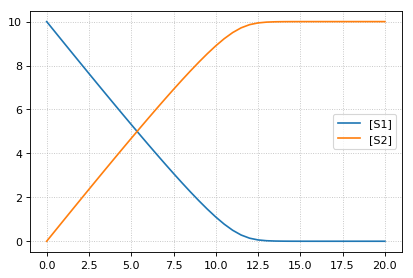
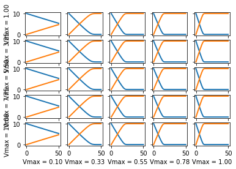

.. code:: ipython2

    import tellurium as te
    from tellurium.analysis.parameterscan import plot2DParameterScan
    
    # model definitions
    r = te.loada("""
    model test
       J0: S1 -> S2; Vmax * (S1/(Km+S1))
        S1 = 10; S2 = 0;
        Vmax = 1; Km = 0.5;
    end
    """)
    s = r.simulate(0, 20, 41)
    r.plot(s)
    
    import numpy as np
    plot2DParameterScan(r,
                        p1='Vmax', p1Range=np.linspace(1, 10, num=5),
                        p2='Vmax', p2Range=np.linspace(0.1, 1.0, num=5),
                        start=0, end=50, points=101)

.. parsed-literal::

    /home/poltergeist/.config/Tellurium/telocal/python-3.6.3/lib/python3.6/site-packages/matplotlib/figure.py:459: UserWarning:
    
    matplotlib is currently using a non-GUI backend, so cannot show the figure
    

