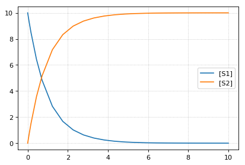

Model Loading
~~~~~~~~~~~~~

To load models use any the following functions. Each function takes a
model with the corresponding format and converts it to a
`RoadRunner <http://sys-bio.github.io/roadrunner/python_docs/index.html>`__
simulator instance.

-  ``te.loadAntimony`` (``te.loada``): Load an Antimony model.
-  ``te.loadSBML``: Load an SBML model.
-  ``te.loadCellML``: Load a CellML model (this passes the model through
   Antimony and converts it to SBML, may be lossy).

.. code-block:: python

    import tellurium as te
    te.setDefaultPlottingEngine('matplotlib')
    
    model = """
    model test
        compartment C1;
        C1 = 1.0;
        species S1, S2;
        
        S1 = 10.0;
        S2 = 0.0;
        S1 in C1; S2 in C1;
        J1: S1 -> S2; k1*S1;
        
        k1 = 1.0;
    end
    """
    # load models
    r = te.loada(model)

Running Simulations
~~~~~~~~~~~~~~~~~~~

Simulating a model in roadrunner is as simple as calling the
``simulate`` function on the RoadRunner instance ``r``. The simulate
acceps three positional arguments: start time, end time, and number of
points. The simulate function also accepts the keyword arguments
``selections``, which is a list of variables to include in the output,
and ``steps``, which is the number of integration time steps and can be
specified instead of number of points.

.. code-block:: python

    # simulate from 0 to 50 with 100 steps
    r.simulate(0, 50, 100)
    # plot the simulation
    r.plot()

.. image:: _notebooks/core/roadrunnerBasics_files/roadrunnerBasics_4_0.png

Integrator and Integrator Settings
~~~~~~~~~~~~~~~~~~~~~~~~~~~~~~~~~~

To set the integrator use ``r.setIntegrator(<integrator-name>)`` or
``r.integrator = <integrator-name>``. RoadRunner supports ``'cvode'``,
``'gillespie'``, and ``'rk4'`` for the integrator name. CVODE uses
adaptive stepping internally, regardless of whether the output is
gridded or not. The size of these internal steps is controlled by the
tolerances, both absolute and relative.

To set integrator settings use ``r.integrator.<setting-name> = <value>``
or ``r.integrator.setValue(<setting-name>, <value>)``. Here are some
important settings for the ``cvode`` integrator:

-  ``variable_step_size``: Adaptive step-size integration
   (``True``/``False``).
-  ``stiff``: Stiff solver for CVODE only (``True``/``False``). Enabled
   by default.
-  ``absolute_tolerance``: Absolute numerical tolerance for integrator
   internal stepping.
-  ``relative_tolerance``: Relative numerical tolerance for integrator
   internal stepping.

Settings for the ``gillespie`` integrator:

-  ``seed``: The RNG seed for the Gillespie method. You can set this
   before running a simulation, or leave it alone for a different seed
   each time. Simulations initialized with the same seed will have the
   same results.

.. code-block:: python

    # what is the current integrator?
    print('The current integrator is:')
    print(r.integrator)
    
    # enable variable stepping
    r.integrator.variable_step_size = True
    # adjust the tolerances (can set directly or via setValue)
    r.integrator.absolute_tolerance = 1e-3 # set directly via property
    r.integrator.setValue('relative_tolerance', 1e-1) # set via a call to setValue
    
    # run a simulation, stop after reaching or passing time 10
    r.reset()
    results = r.simulate(0, 10)
    r.plot()
    
    # print the time values from the simulation
    print('Time values:')
    print(results[:,0])

.. parsed-literal::

    The current integrator is:
    < roadrunner.Integrator() >
      name: cvode
      settings:
          relative_tolerance: 0.000001
          absolute_tolerance: 0.000000000001
                       stiff: true
           maximum_bdf_order: 5
         maximum_adams_order: 12
           maximum_num_steps: 20000
           maximum_time_step: 0
           minimum_time_step: 0
           initial_time_step: 0
              multiple_steps: false
          variable_step_size: false
    

.. parsed-literal::

    Time values:
    [0.00000000e+00 3.43225906e-07 3.43260229e-03 3.77551929e-02
     7.20777836e-02 1.60810095e-01 4.37546265e-01 7.14282434e-01
     1.23145372e+00 1.74862501e+00 2.26579629e+00 2.78296758e+00
     3.30013887e+00 3.81731015e+00 4.33448144e+00 4.85165273e+00
     5.36882401e+00 5.88599530e+00 6.40316659e+00 6.92033787e+00
     7.43750916e+00 7.95468045e+00 8.47185173e+00 9.25832855e+00
     1.00000000e+01]

.. code-block:: python

    # set integrator to Gillespie solver
    r.setIntegrator('gillespie')
    # identical ways to set integrator
    r.setIntegrator('rk4')
    r.integrator = 'rk4'
    # set back to cvode (the default)
    r.setIntegrator('cvode')
    
    # set integrator settings
    r.integrator.setValue('variable_step_size', False)
    r.integrator.setValue('stiff', True)
    
    # print integrator settings
    print(r.integrator)

.. parsed-literal::

    < roadrunner.Integrator() >
      name: cvode
      settings:
          relative_tolerance: 0.1
          absolute_tolerance: 0.001
                       stiff: true
           maximum_bdf_order: 5
         maximum_adams_order: 12
           maximum_num_steps: 20000
           maximum_time_step: 0
           minimum_time_step: 0
           initial_time_step: 0
              multiple_steps: false
          variable_step_size: false
    

Simulation options
~~~~~~~~~~~~~~~~~~

The ``RoadRunner.simulate`` method is responsible for running
simulations using the current integrator. It accepts the following
arguments:

-  ``start``: Start time.
-  ``end``: End time.
-  ``points``: Number of points in solution (exclusive with steps, do
   not pass both). If the output is gridded, the points will be evenly
   spaced in time. If not, the simulation will stop when it reaches the
   ``end`` time or the number of points, whichever happens first.
-  ``steps``: Number of steps in solution (exclusive with points, do not
   pass both).

.. code-block:: python

    # simulate from 0 to 6 with 6 points in the result
    r.reset()
    # pass args explicitly via keywords
    res1 = r.simulate(start=0, end=10, points=6)
    print(res1)
    r.reset()
    # use positional args to pass start, end, num. points
    res2 = r.simulate(0, 10, 6)
    print(res2)

.. parsed-literal::

        time,       [S1],    [S2]
     [[    0,         10,       0],
      [    2,    1.23775, 8.76225],
      [    4,   0.253289, 9.74671],
      [    6,  0.0444091, 9.95559],
      [    8, 0.00950381,  9.9905],
      [   10, 0.00207671, 9.99792]]
    
        time,       [S1],    [S2]
     [[    0,         10,       0],
      [    2,    1.23775, 8.76225],
      [    4,   0.253289, 9.74671],
      [    6,  0.0444091, 9.95559],
      [    8, 0.00950381,  9.9905],
      [   10, 0.00207671, 9.99792]]
    

Selections
~~~~~~~~~~

The selections list can be used to set which state variables will appear
in the output array. By default, it includes all SBML species and the
``time`` variable. Selections can be either given as argument to
``r.simulate``.

.. code-block:: python

    print('Floating species in model:')
    print(r.getFloatingSpeciesIds())
    # provide selections to simulate
    print(r.simulate(0,10,6, selections=r.getFloatingSpeciesIds()))
    r.resetAll()
    # try different selections
    print(r.simulate(0,10,6, selections=['time','J1']))

.. parsed-literal::

    Floating species in model:
    ['S1', 'S2']
                  S1,      S2
     [[   0.00207671, 9.99792],
      [  0.000295112,  9.9997],
      [ -0.000234598, 10.0002],
      [ -0.000203385, 10.0002],
      [   -9.474e-05, 10.0001],
      [ -3.43429e-05,      10]]
    
        time,         J1
     [[    0,         10],
      [    2,    1.23775],
      [    4,   0.253289],
      [    6,  0.0444091],
      [    8, 0.00950381],
      [   10, 0.00207671]]
    

Reset model variables
~~~~~~~~~~~~~~~~~~~~~

To reset the model's state variables use the ``r.reset()`` and
``r.reset(SelectionRecord.*)`` functions. If you have made modifications
to parameter values, use the ``r.resetAll()`` function to reset
parameters to their initial values when the model was loaded.

.. code-block:: python

    # show the current values
    for s in ['S1', 'S2']:
        print('r.{} == {}'.format(s, r[s]))
    # reset initial concentrations
    r.reset()
    print('reset')
    # S1 and S2 have now again the initial values
    for s in ['S1', 'S2']:
        print('r.{} == {}'.format(s, r[s]))
    # change a parameter value
    print('r.k1 before = {}'.format(r.k1))
    r.k1 = 0.1
    print('r.k1 after = {}'.format(r.k1))
    # reset parameters
    r.resetAll()
    print('r.k1 after resetAll = {}'.format(r.k1))

.. parsed-literal::

    r.S1 == 0.0020767122285295023
    r.S2 == 9.997923287771478
    reset
    r.S1 == 10.0
    r.S2 == 0.0
    r.k1 before = 1.0
    r.k1 after = 0.1
    r.k1 after resetAll = 1.0

