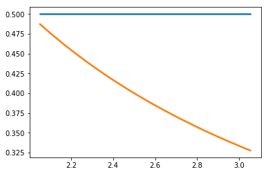

Steady state scan
~~~~~~~~~~~~~~~~~

Using ``te.ParameterScan.SteadyStateScan`` for scanning the steady
state.

.. code:: ipython2

    import tellurium as te
    import matplotlib.pyplot as plt
    import tellurium as te
    import numpy as np
    from roadrunner import Config
    
    Config.setValue(Config.LOADSBMLOPTIONS_CONSERVED_MOIETIES, True) 
    
    r = te.loada('''
        $Xo -> S1; vo;
        S1 -> S2; k1*S1 - k2*S2;
        S2 -> $X1; k3*S2;
        
        vo = 1
        k1 = 2; k2 = 0; k3 = 3;
    ''')
    
    p = te.SteadyStateScan(r,
        value = 'k3',
        startValue = 2,
        endValue = 3,
        numberOfPoints = 20,
        selection = ['S1', 'S2']                      
    )
    p.plotArray()
    
    Config.setValue(Config.LOADSBMLOPTIONS_CONSERVED_MOIETIES, False) 

