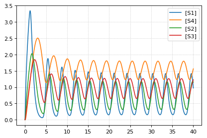
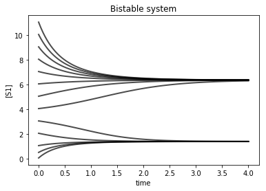
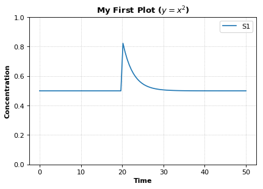
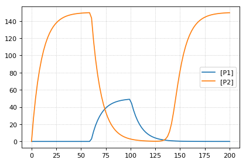
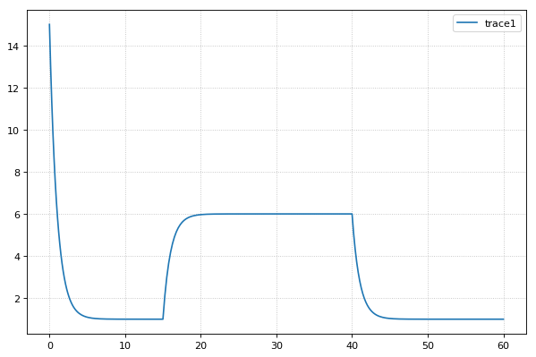
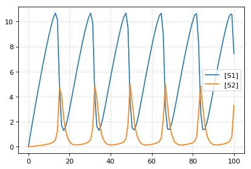
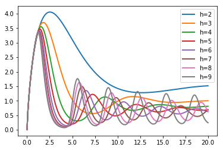
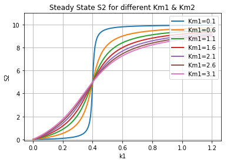

Preliminaries
~~~~~~~~~~~~~

In order to draw the network graphs in these examples, you will need
graphviz and pygraphviz installed. Please consult the Graphviz
documentation for instructions on installing it on your platform. If you
cannot install Graphviz and pygraphviz, you can still run the following
examples, but the network diagrams will not be generated.

Also, due to limitations in pygraphviz, these examples can only be run
in the Jupyter notebook, not the `Tellurium notebook
app <http://tellurium.readthedocs.io/en/latest/installation.html#front-end-1-tellurium-notebook>`__.

.. code-block:: python

    # install pygraphviz (requires compilation)
    import sys
    print('Please run \n    {} -m pip install pygraphviz\nfrom a terminal or command propt (without the quotes) to install pygraphviz. Then restart your kernel in this notebook (Language->Restart Running Kernel).'.format(sys.executable))

.. parsed-literal::

    Please run 
        /home/poltergeist/.config/Tellurium/telocal/python-3.6.3/bin/python3.6 -m pip install pygraphviz
    from a terminal or command propt (without the quotes) to install pygraphviz. Then restart your kernel in this notebook (Language->Restart Running Kernel).

Troubleshooting Graphviz Installation
~~~~~~~~~~~~~~~~~~~~~~~~~~~~~~~~~~~~~

pygraphviz has `known
problems <https://github.com/pygraphviz/pygraphviz/issues/72>`__ during
installation on some platforms. On 64-bit Fedora Linux, we have been
able to use the following command to install pygraphviz:

.. code:: bash

    /path/to/python3 -m pip install pygraphviz --install-option="--include-path=/usr/include/graphviz" --install-option="--library-path=/usr/lib64/graphviz/"

You may need to modify the library/include paths in the above command.
Some Linux distributions put 64-bit libraries in ``/usr/lib`` instead of
``/usr/lib64``, in which case the command becomes:

.. code:: bash

    /path/to/python3 -m pip install pygraphviz --install-option="--include-path=/usr/include/graphviz" --install-option="--library-path=/usr/lib/graphviz/"

Case Studies
------------

Activator system
~~~~~~~~~~~~~~~~

.. code-block:: python

    import tellurium as te
    te.setDefaultPlottingEngine('matplotlib')
    
    # model Definition
    r = te.loada ('''
            #J1: S1 -> S2; Activator*kcat1*S1/(Km1+S1);
            J1: S1 -> S2; SE2*kcat1*S1/(Km1+S1);
            J2: S2 -> S1; Vm2*S2/(Km2+S2);
            
            J3: T1 -> T2; S2*kcat3*T1/(Km3+T1);
            J4: T2 -> T1; Vm4*T2/(Km4+T2);
            
            J5:    -> E2; Vf5/(Ks5+T2^h5);
            J6:    -> E3; Vf6*T2^h6/(Ks6+T2^h6);
            
            #J7:    -> E1;
            J8:    ->  S; kcat8*E1
            
            J9: E2 ->   ; k9*E2;
            J10:E3 ->   ; k10*E3;
            
            J11: S -> SE2; E2*kcat11*S/(Km11+S);
            J12: S -> SE3; E3*kcat12*S/(Km12+S);
            
            J13: SE2 ->  ; SE2*kcat13; 
            J14: SE3 ->  ; SE3*kcat14; 
            
            Km1 = 0.01; Km2 = 0.01; Km3 = 0.01; Km4 = 0.01; Km11 = 1; Km12 = 0.1;
            S1 = 6; S2 =0.1; T1=6; T2 = 0.1;
            SE2 = 0; SE3=0;
            S=0;
            E2 = 0; E3 = 0;
            kcat1 = 0.1; kcat3 = 3; kcat8 =1; kcat11 = 1; kcat12 = 1; kcat13 = 0.1; kcat14=0.1;
            E1 = 1;
            k9 = 0.1; k10=0.1;
            Vf6 = 1;
            Vf5 = 3;
            Vm2 = 0.1;
            Vm4 = 2;
            h6 = 2; h5=2;
            Ks6 = 1; Ks5 = 1;
            Activator = 0;
    
            at (time > 100): Activator = 5;  
    ''')
    r.draw(width=300)
    r.conservedMoietyAnalysis = True
    result = r.simulate (0, 300, 2000, ['time', 'J11', 'J12']);
    r.plot(result);

::

    ---------------------------------------------------------------------------

    AttributeError                            Traceback (most recent call last)

    <ipython-input-2-65bec52b7aca> in <module>()
         45         at (time > 100): Activator = 5;
         46 ''')
    ---> 47 r.draw(width=300)
         48 r.conservedMoietyAnalysis = True
         49 result = r.simulate (0, 300, 2000, ['time', 'J11', 'J12']);

    /extra/devel/src/tellurium/tellurium/roadrunner/extended_roadrunner.py in draw(self, **kwargs)
        286 
        287         from tellurium import SBMLDiagram
    --> 288         diagram = SBMLDiagram(self.getSBML())
        289         diagram.draw(**kwargs)
        290 

    /extra/devel/src/tellurium/tellurium/visualization/sbmldiagram.py in __init__(self, sbml, species, reactions, reactants, products, modifiers)
         59                                           reactants=reactants,
         60                                           products=products,
    ---> 61                                           modifiers=modifiers)
         62 
         63 

    /extra/devel/src/tellurium/tellurium/visualization/sbmldiagram.py in _createGraph(model, species, reactions, reactants, products, modifiers)
         89             warnings.warn("'pygraphviz' could not be imported, cannot draw network diagrams", ImportWarning, stacklevel=2)
         90 
    ---> 91         g = pgv.AGraph(strict=False, directed=True)
         92 
         93         # set some default node attributes

    AttributeError: 'NoneType' object has no attribute 'AGraph'

Feedback oscillations
~~~~~~~~~~~~~~~~~~~~~

.. code-block:: python

    # http://tellurium.analogmachine.org/testing/
    import tellurium as te
    r = te.loada ('''
    model feedback()
       // Reactions:
       J0: $X0 -> S1; (VM1 * (X0 - S1/Keq1))/(1 + X0 + S1 +   S4^h);
       J1: S1 -> S2; (10 * S1 - 2 * S2) / (1 + S1 + S2);
       J2: S2 -> S3; (10 * S2 - 2 * S3) / (1 + S2 + S3);
       J3: S3 -> S4; (10 * S3 - 2 * S4) / (1 + S3 + S4);
       J4: S4 -> $X1; (V4 * S4) / (KS4 + S4);
    
      // Species initializations:
      S1 = 0; S2 = 0; S3 = 0;
      S4 = 0; X0 = 10; X1 = 0;
    
      // Variable initialization:
      VM1 = 10; Keq1 = 10; h = 10; V4 = 2.5; KS4 = 0.5;
    end''')
    
    r.integrator.setValue('variable_step_size', True)
    res = r.simulate(0, 40)
    r.plot()

Bistable System
~~~~~~~~~~~~~~~

Example showing how to to multiple time course simulations, merging the
data and plotting it onto one platting surface. Alternative is to use
setHold()

Model is a bistable system, simulations start with different initial
conditions resulting in different steady states reached.

.. code-block:: python

    import tellurium as te
    import numpy as np
    
    r = te.loada ('''
    $Xo -> S1; 1 + Xo*(32+(S1/0.75)^3.2)/(1 +(S1/4.3)^3.2);
    S1 -> $X1; k1*S1;
    
    Xo = 0.09; X1 = 0.0;
    S1 = 0.5; k1 = 3.2;
    ''')
    print(r.selections)
    
    initValue = 0.05
    m = r.simulate (0, 4, 100, selections=["time", "S1"])
    
    for i in range (0,12):
        r.reset()
        r['[S1]'] = initValue
        res = r.simulate (0, 4, 100, selections=["S1"])
        m = np.concatenate([m, res], axis=1)
        initValue += 1
    
    te.plotArray(m, color="black", alpha=0.7, loc=None, 
                 xlabel="time", ylabel="[S1]", title="Bistable system");

.. parsed-literal::

    ['time', '[S1]']

Add plot elements
~~~~~~~~~~~~~~~~~

.. code-block:: python

    import tellurium as te
    import numpy
    import roadrunner
    
    # Example showing how to embelise a graph, change title, axes labels.
    # Example also uses an event to pulse S1
    
    r = te.loada ('''
       $Xo -> S1; k1*Xo;
       S1 -> $X1; k2*S1;
       
       k1 = 0.2; k2 = 0.4; Xo = 1; S1 = 0.5;
       at (time > 20): S1 = S1 + 0.35
    ''')
    
    # Simulate the first part up to 20 time units
    m = r.simulate (0, 50, 100, ["time", "S1"])
    
    r.plot(m, ylim=(0.,1.), xtitle='Time', ytitle='Concentration', title='My First Plot ($y = x^2$)')

Events
~~~~~~

.. code-block:: python

    import tellurium as te
    import matplotlib.pyplot as plt
    
    # Example showing use of events and how to set the y axis limits
    r = te.loada ('''
      $Xo -> S;   Xo/(km + S^h);
      S -> $w;  k1*S;       
    
         # initialize
         h = 1;   # Hill coefficient
         k1 = 1;  km = 0.1;
         S = 1.5; Xo = 2
         
         at (time > 10): Xo = 5;
         at (time > 20): Xo = 2;
    ''')
    
    m1 = r.simulate (0, 30, 200, ['time', 'Xo', 'S'])
    r.plot(ylim=(0,10))

.. image:: _notebooks/core/tellurium_examples_files/tellurium_examples_12_0.png

Gene network
~~~~~~~~~~~~

.. code-block:: python

    import tellurium as te
    import numpy
    
    # Model desribes a cascade of two genes. First gene is activated
    # second gene is repressed. Uses events to change the input 
    # to the gene regulatory network
    
    r = te.loada ('''
        v1:  -> P1; Vm1*I^4/(Km1 + I^4);
        v2:  P1 -> ; k1*P1;
        v3:  -> P2;  Vm2/(Km2 + P1^4);
        v4:  P2 -> ; k2*P2;
        
        at (time > 60): I = 10;
        at (time > 100): I = 0.01;
        Vm1  = 5; Vm2 = 6; Km1 = 0.5; Km2 = 0.4;
        k1 = 0.1; k2 = 0.1;
        I = 0.01;
    ''')
    
    result = r.simulate (0, 200, 100)
    r.plot()

Stoichiometric matrix
~~~~~~~~~~~~~~~~~~~~~

.. code-block:: python

    import tellurium as te
    
    # Example of using antimony to create a stoichiometry matrix 
    r = te.loada('''
     J1: -> S1; v1;
     J2: S1 -> S2; v2;
     J3: S2 -> ; v3;
     J4: S3 -> S1; v4;
     J5: S3 -> S2; v5;
     J6: -> S3; v6;
     
     v1=1; v2=1; v3=1; v4=1; v5=1; v6=1;
    ''')
    
    print(r.getFullStoichiometryMatrix())
    r.draw()

.. parsed-literal::

          J1, J2, J3, J4, J5, J6
    S1 [[  1, -1,  0,  1,  0,  0],
    S2  [  0,  1, -1,  0,  1,  0],
    S3  [  0,  0,  0, -1, -1,  1]]
    

::

    ---------------------------------------------------------------------------

    AttributeError                            Traceback (most recent call last)

    <ipython-input-8-2c9377ed179d> in <module>()
         14 
         15 print(r.getFullStoichiometryMatrix())
    ---> 16 r.draw()
    

    /extra/devel/src/tellurium/tellurium/roadrunner/extended_roadrunner.py in draw(self, **kwargs)
        286 
        287         from tellurium import SBMLDiagram
    --> 288         diagram = SBMLDiagram(self.getSBML())
        289         diagram.draw(**kwargs)
        290 

    /extra/devel/src/tellurium/tellurium/visualization/sbmldiagram.py in __init__(self, sbml, species, reactions, reactants, products, modifiers)
         59                                           reactants=reactants,
         60                                           products=products,
    ---> 61                                           modifiers=modifiers)
         62 
         63 

    /extra/devel/src/tellurium/tellurium/visualization/sbmldiagram.py in _createGraph(model, species, reactions, reactants, products, modifiers)
         89             warnings.warn("'pygraphviz' could not be imported, cannot draw network diagrams", ImportWarning, stacklevel=2)
         90 
    ---> 91         g = pgv.AGraph(strict=False, directed=True)
         92 
         93         # set some default node attributes

    AttributeError: 'NoneType' object has no attribute 'AGraph'

Lorenz attractor
~~~~~~~~~~~~~~~~

Example showing how to describe a model using ODES. Example implements
the Lorenz attractor.

.. code-block:: python

    import tellurium as te
    
    r = te.loada ('''
         x' = sigma*(y - x);
         y' = x*(rho - z) - y;
         z' = x*y - beta*z;
    
         x = 0.96259;  y = 2.07272;  z = 18.65888;
    
         sigma = 10;  rho = 28; beta = 2.67;
    ''')
    
    result = r.simulate (0, 20, 1000, ['time', 'x', 'y', 'z'])
    r.plot()

.. image:: _notebooks/core/tellurium_examples_files/tellurium_examples_18_0.png

Time Course Parameter Scan
~~~~~~~~~~~~~~~~~~~~~~~~~~

Do 5 simulations on a simple model, for each simulation a parameter,
``k1`` is changed. The script merges the data together and plots the
merged array on to one plot.

.. code-block:: python

    import tellurium as te
    import numpy as np
    
    r = te.loada ('''
        J1: $X0 -> S1; k1*X0;
        J2: S1 -> $X1; k2*S1;
    
        X0 = 1.0; S1 = 0.0; X1 = 0.0;
        k1 = 0.4; k2 = 2.3;
    ''')  
      
      
    m = r.simulate (0, 4, 100, ["Time", "S1"])
    for i in range (0,4):
        r.k1 = r.k1 + 0.1 
        r.reset()
        m = np.hstack([m, r.simulate(0, 4, 100, ['S1'])])
    
    # use plotArray to plot merged data
    te.plotArray(m)
    pass

.. image:: _notebooks/core/tellurium_examples_files/tellurium_examples_20_0.png

Merge multiple simulations
~~~~~~~~~~~~~~~~~~~~~~~~~~

Example of merging multiple simulations. In between simulations a
parameter is changed.

.. code-block:: python

    import tellurium as te
    import numpy
    
    r = te.loada ('''
        # Model Definition
        v1: $Xo -> S1;  k1*Xo;
        v2: S1 -> $w;   k2*S1;
    
        # Initialize constants 
        k1 = 1; k2 = 1; S1 = 15; Xo = 1;
    ''')
    
    # Time course simulation
    m1 = r.simulate (0, 15, 100, ["Time","S1"]);
    r.k1 = r.k1 * 6;
    m2 = r.simulate (15, 40, 100, ["Time","S1"]);
    r.k1 = r.k1 / 6;
    m3 = r.simulate (40, 60, 100, ["Time","S1"]);
    
    m = numpy.vstack([m1, m2, m3])
    p = te.plot(m[:,0], m[:,1], name='trace1')

Relaxation oscillator
~~~~~~~~~~~~~~~~~~~~~

Oscillator that uses positive and negative feedback. An example of a
relaxation oscillator.

.. code-block:: python

    import tellurium as te
    
    r = te.loada ('''
      v1: $Xo -> S1; k1*Xo;
      v2:  S1 -> S2; k2*S1*S2^h/(10 + S2^h) + k3*S1;
      v3:  S2 -> $w; k4*S2;      
    
      # Initialize
      h  = 2; # Hill coefficient
      k1 = 1; k2 = 2; Xo = 1;
      k3 = 0.02; k4 = 1;
    ''')
    
    result = r.simulate(0, 100, 100)
    r.plot(result);

Scan hill coefficient
~~~~~~~~~~~~~~~~~~~~~

Negative Feedback model where we scan over the value of the Hill
coefficient.

.. code-block:: python

    import tellurium as te
    import numpy as np
    
    r = te.loada ('''
      // Reactions:
      J0: $X0 => S1; (J0_VM1*(X0 - S1/J0_Keq1))/(1 + X0 + S1 + S4^J0_h);
      J1: S1 => S2; (10*S1 - 2*S2)/(1 + S1 + S2);
      J2: S2 => S3; (10*S2 - 2*S3)/(1 + S2 + S3);
      J3: S3 => S4; (10*S3 - 2*S4)/(1 + S3 + S4);
      J4: S4 => $X1; (J4_V4*S4)/(J4_KS4 + S4);
    
      // Species initializations:
      S1 = 0;
      S2 = 0;
      S3 = 0;
      S4 = 0;
      X0 = 10;
      X1 = 0;
    
      // Variable initializations:
      J0_VM1 = 10;
      J0_Keq1 = 10;
      J0_h = 2;
      J4_V4 = 2.5;
      J4_KS4 = 0.5;
    
      // Other declarations:
      const J0_VM1, J0_Keq1, J0_h, J4_V4, J4_KS4;
    ''')
    
    # time vector
    result = r.simulate (0, 20, 201, ['time'])
    
    h_values = [r.J0_h + k for k in range(0,8)]
    for h in h_values:
        r.reset()
        r.J0_h = h
        m = r.simulate(0, 20, 201, ['S1'])
        result = numpy.hstack([result, m])
        
    te.plotArray(result, labels=['h={}'.format(int(h)) for h in h_values])
    pass

Compare simulations
~~~~~~~~~~~~~~~~~~~

.. code-block:: python

    import tellurium as te
    
    r = te.loada ('''
         v1: $Xo -> S1;  k1*Xo;
         v2: S1 -> $w;   k2*S1;
    
         //initialize.  Deterministic process.
         k1 = 1; k2 = 1; S1 = 20; Xo = 1;
    ''')
    
    m1 = r.simulate (0,20,100);
    
    # Stochastic process
    r.resetToOrigin()
    r.setSeed(1234)
    m2 = r.gillespie(0, 20, 100, ['time', 'S1'])
    
    # plot all the results together
    te.plotArray(m1, color="black", show=False)
    te.plotArray(m2, color="blue");

.. image:: _notebooks/core/tellurium_examples_files/tellurium_examples_28_0.png

Sinus injection
~~~~~~~~~~~~~~~

Example that show how to inject a sinusoidal into the model and use
events to switch it off and on.

.. code-block:: python

    import tellurium as te
    import numpy
    
    r = te.loada ('''
        # Inject sin wave into model    
        Xo := sin (time*0.5)*switch + 2;    
        
        # Model Definition
        v1: $Xo -> S1;  k1*Xo;
        v2: S1 -> S2;   k2*S1;
        v3: S2 -> $X1;  k3*S2;
    
        at (time > 40): switch = 1;
        at (time > 80): switch = 0.5;
        
        # Initialize constants 
        k1 = 1; k2 = 1; k3 = 3; S1 = 3; 
        S2 = 0; 
        switch = 0;
    ''')
    
    result = r.simulate (0, 100, 200, ['time', 'S1', 'S2'])
    r.plot(result);

.. image:: _notebooks/core/tellurium_examples_files/tellurium_examples_30_0.png

Protein phosphorylation cycle
~~~~~~~~~~~~~~~~~~~~~~~~~~~~~

Simple protein phosphorylation cycle. Steady state concentation of the
phosphorylated protein is plotted as a funtion of the cycle kinase. In
addition, the plot is repeated for various values of Km.

.. code-block:: python

    import tellurium as te
    import numpy as np
    
    r = te.loada ('''
       S1 -> S2; k1*S1/(Km1 + S1);
       S2 -> S1; k2*S2/(Km2 + S2);
       
       k1 = 0.1; k2 = 0.4; S1 = 10; S2 = 0;
       Km1 = 0.1; Km2 = 0.1;  
    ''')
    
    r.conservedMoietyAnalysis = True
    
    for i in range (1,8):
      numbers = np.linspace (0, 1.2, 200)
      result = np.empty ([0,2])
      for value in numbers:
          r.k1 = value
          r.steadyState()
          row = np.array ([value, r.S2])
          result = np.vstack ((result, row))
      te.plotArray(result, show=False, labels=['Km1={}'.format(r.Km1)],
                   resetColorCycle=False,
                   xlabel='k1', ylabel="S2", 
                   title="Steady State S2 for different Km1 & Km2",
                   ylim=[-0.1, 11], grid=True)
      r.k1 = 0.1
      r.Km1 = r.Km1 + 0.5;
      r.Km2 = r.Km2 + 0.5;

