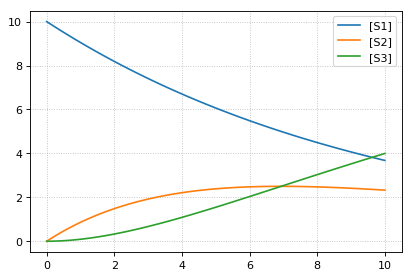

Load Antimony
^^^^^^^^^^^^^

Antimony files can be read with ``te.loada`` or
``te.loadAntimonyModel``. For SBML ``te.loadSBMLModel``, for CellML
``te.loadCellMLModel`` is used. All the functions accept either model
strings or respective model files.

.. code-block:: python

    import tellurium as te
    te.setDefaultPlottingEngine('matplotlib')
    
    # Load an antimony model
    ant_model = '''
        S1 -> S2; k1*S1;
        S2 -> S3; k2*S2;
    
        k1= 0.1; k2 = 0.2; 
        S1 = 10; S2 = 0; S3 = 0;
    '''
    # At the most basic level one can load the SBML model directly using libRoadRunner
    print('---  load using roadrunner ---')
    import roadrunner
    # convert to SBML model
    sbml_model = te.antimonyToSBML(ant_model)
    r = roadrunner.RoadRunner(sbml_model)
    result = r.simulate(0, 10, 100)
    r.plot(result)
    
    # The method loada is simply a shortcut to loadAntimonyModel
    print('---  load using tellurium ---')
    r = te.loada(ant_model)
    result = r.simulate (0, 10, 100)
    r.plot(result)
    
    # same like
    r = te.loadAntimonyModel(ant_model)

.. parsed-literal::

    ---  load using roadrunner ---

.. parsed-literal::

    ---  load using tellurium ---

.. image:: _notebooks/core/tellurium_model_loading_files/tellurium_model_loading_2_3.png

