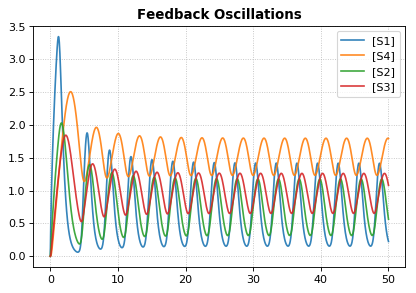

Logarithmic axis
~~~~~~~~~~~~~~~~

The axis scale can be adapted with the ``xscale`` and ``yscale``
settings.

.. code-block:: python

    import tellurium as te
    te.setDefaultPlottingEngine('matplotlib')
    r = te.loadTestModel('feedback.xml')
    r.integrator.variable_step_size = True
    s = r.simulate(0, 50)
    r.plot(s, logx=True, xlim=[10E-4, 10E2],
          title="Logarithmic x-Axis with grid", ylabel="concentration");
          

.. image:: _notebooks/core/tellurium_plotting_files/tellurium_plotting_4_0.png

Plotting multiple simulations
~~~~~~~~~~~~~~~~~~~~~~~~~~~~~

All plotting is done via the ``r.plot`` or ``te.plotArray`` functions.
To plot multiple curves in one figure use the ``show=False`` setting.

.. code-block:: python

    import tellurium as te
    te.setDefaultPlottingEngine('matplotlib')
    import numpy as np
    import matplotlib.pylab as plt
    
    # Load a model and carry out a simulation generating 100 points
    r = te.loada ('S1 -> S2; k1*S1; k1 = 0.1; S1 = 10')
    r.draw(width=100)
    
    # get colormap
    # Colormap instances are used to convert data values (floats) from the interval [0, 1]
    cmap = plt.get_cmap('Blues')
    
    k1_values = np.linspace(start=0.1, stop=1.5, num=15)
    max_k1 = max(k1_values)
    for k, value in enumerate(k1_values):
        r.reset()
        r.k1 = value
        s = r.simulate(0, 30, 100)
        
        color = cmap((value+max_k1)/(2*max_k1))
        # use show=False to plot multiple curves in the same figure
        r.plot(s, show=False, title="Parameter variation k1", xtitle="time", ytitle="concentration", 
              xlim=[-1, 31], ylim=[-0.1, 11])
    
    te.show()
    
    print('Reference Simulation: k1 = {}'.format(r.k1))
    print('Parameter variation: k1 = {}'.format(k1_values))

.. image:: _notebooks/core/tellurium_plotting_files/tellurium_plotting_2_0.png

.. image:: _notebooks/core/tellurium_plotting_files/tellurium_plotting_2_1.png

.. parsed-literal::

    Reference Simulation: k1 = 1.5
    Parameter variation: k1 = [0.1 0.2 0.3 0.4 0.5 0.6 0.7 0.8 0.9 1.  1.1 1.2 1.3 1.4 1.5]

Using Tags and Names
~~~~~~~~~~~~~~~~~~~~

Tags can be used to coordinate the color, opacity, and legend names between several sets of data. This can be used to highlight certain features that these datasets have in common. Names allow you to give a more meaningful description of the data in the legend.

.. code-block:: python

    import tellurium as te
    import numpy as np

    for i in range(1, 10):
        x = np.linspace(0, 10, num = 10)
        y = i*x**2 + 10*i

        if i % 2 == 0:
            next_tag = "positive slope"
        else:
            next_tag = "negative slope"
            y = -1*y

        next_name = next_tag + " (i = " + str(i) + ")"    
        te.plot(x, y, show = False, tag = next_tag, name = next_name)

    te.show()

.. image:: _notebooks/core/tellurium_plotting_files/tellurium_plotting_3_0.png

Note that only two items show up in the legend, one for each tag used. In this case, the name found in the legend will match the name of the last set of data plotted using that specific tag. The color and opacity for each tagged groups will also be chosen from the last dataset inputted with that given tag.

Subplots
~~~~~~~~

``te.plotArray`` can be used in conjunction with matplotlib functions to create subplots.

.. code-block:: python

    import tellurium as te
    import numpy as np
    import matplotlib.pylab as plt

    r = te.loada ('S1 -> S2; k1*S1; k1 = 0.1; S1 = 20')
    r.setIntegrator('gillespie')
    r.integrator.seed = '1234'
    kValues = np.linspace(0.1, 0.9, num=9) # generate k1 values

    plt.gcf().set_size_inches(10, 10) # size of figure
    plt.subplots_adjust(wspace=0.4, hspace=0.4) # adjust the space between subplots
    plt.suptitle('Variation in k1 value', fontsize=16) # main title

    for i in range(1, len(kValues) + 1):
        r.k1 = kValues[i - 1]
        # designates number of subplots (row, col) and spot to plot next
        plt.subplot(3, 3, i)  
        for j in range(1, 30):
            r.reset()
            s = r.simulate(0, 10)
            t = "k1 = " + '{:.1f}'.format(kValues[i - 1])
            # plot each subplot, use show=False to save multiple traces
            te.plotArray(s, show=False, title=t, xlabel='Time', 
                         ylabel='Concentration', alpha=0.7)

.. image:: _notebooks/core/tellurium_plotting_files/tellurium_plotting_1_0.png

Draw diagram
~~~~~~~~~~~~

This example shows how to draw a network diagram, `requires
graphviz <http://tellurium.readthedocs.io/en/latest/notebooks.html#preliminaries>`__.

.. code-block:: python

    import tellurium as te
    te.setDefaultPlottingEngine('matplotlib')
    
    r = te.loada('''
    model feedback()
       // Reactions:http://localhost:8888/notebooks/core/tellurium_export.ipynb#
       J0: $X0 -> S1; (VM1 * (X0 - S1/Keq1))/(1 + X0 + S1 +   S4^h);
       J1: S1 -> S2; (10 * S1 - 2 * S2) / (1 + S1 + S2);
       J2: S2 -> S3; (10 * S2 - 2 * S3) / (1 + S2 + S3);
       J3: S3 -> S4; (10 * S3 - 2 * S4) / (1 + S3 + S4);
       J4: S4 -> $X1; (V4 * S4) / (KS4 + S4);
    
      // Species initializations:
      S1 = 0; S2 = 0; S3 = 0;
      S4 = 0; X0 = 10; X1 = 0;
    
      // Variable initialization:
      VM1 = 10; Keq1 = 10; h = 10; V4 = 2.5; KS4 = 0.5;
    end''')
    
    # simulate using variable step size
    r.integrator.setValue('variable_step_size', True)
    s = r.simulate(0, 50)
    # draw the diagram
    r.draw(width=200)
    # and the plot
    r.plot(s, title="Feedback Oscillations", ylabel="concentration", alpha=0.9);

.. image:: _notebooks/core/tellurium_plotting_files/tellurium_plotting_6_0.png

