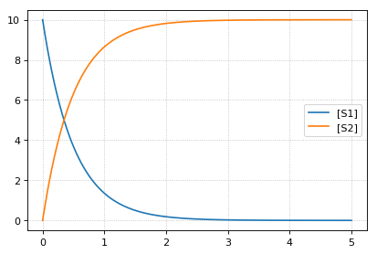
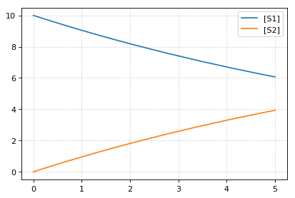

Reset model values
^^^^^^^^^^^^^^^^^^

The ``reset`` function of a
`RoadRunner <http://sys-bio.github.io/roadrunner/python_docs/index.html>`__
instance reset the system variables (usu. species concentrations) to
their respective initial values. ``resetAll`` also resets parameters.
``resetToOrigin`` completely resets the model.

.. code-block:: python

    import tellurium as te
    te.setDefaultPlottingEngine('matplotlib')
    
    r = te.loada ('S1 -> S2; k1*S1; k1 = 0.1; S1 = 10')
    r.integrator.setValue('variable_step_size', True)
    # simulate model
    sim1 = r.simulate(0, 5)
    print('*** sim1 ***')
    r.plot(sim1)
    
    # continue from end concentration of sim1
    r.k1 = 2.0
    sim2 = r.simulate(0, 5)
    print('-- sim2 --')
    print('continue simulation from final concentrations with changed parameter')
    r.plot(sim2)
    
    # Reset initial concentrations, does not affect the changed parameter
    r.reset()
    sim3 = r.simulate(0, 5)
    print('-- sim3 --')
    print('reset initial concentrations but keep changed parameter')
    r.plot(sim3)
    
    # Reset model to the state it was loaded
    r.resetToOrigin()
    sim4 = r.simulate(0, 5)
    print('-- sim4 --')
    print('reset all to origin')
    r.plot(sim4);

.. parsed-literal::

    *** sim1 ***

.. parsed-literal::

    -- sim2 --
    continue simulation from final concentrations with changed parameter

.. image:: _notebooks/core/tellurium_reset_files/tellurium_reset_2_3.png

.. parsed-literal::

    -- sim3 --
    reset initial concentrations but keep changed parameter

.. parsed-literal::

    -- sim4 --
    reset all to origin

