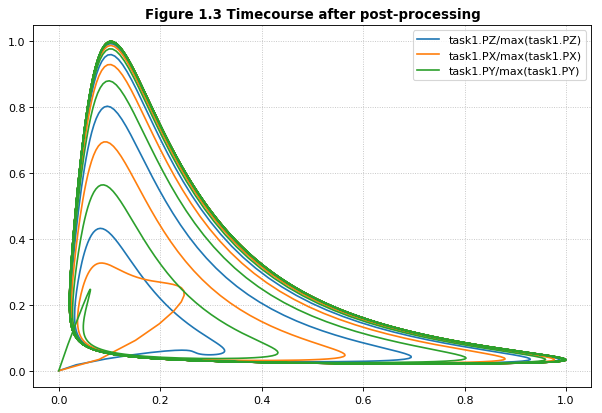

Working with SED-ML
~~~~~~~~~~~~~~~~~~~

SED-ML describes how to run a set of simulations on a model encoded in
SBML or CellML through specifying tasks, algorithm parameters, and
post-processing. SED-ML has a limited vocabulary of simulation types
(timecourse and steady state) is not designed to replace scripting with
Python or other general-purpose languages. Instead, SED-ML is designed
to provide a rudimentary way to reproduce the dynamics of a model across
different tools. This process would otherwise require human intervention
and becomes very laborious when thousands of models are involved.

The basic elements of a SED-ML document are:

-  **Models**, which reference external SBML/CellML files or other
   previously defined models within the same SED-ML document,
-  **Simulations**, which reference specific numerical solvers from the
   `KiSAO ontology <http://co.mbine.org/standards/kisao>`__,
-  **Tasks**, which apply a simulation to a model, and
-  **Outputs**, which can be plots or reports.

Models in SED-ML essentially create instances of SBML/CellML models, and
each instance can have different parameters.

Tellurium's approach to handling SED-ML is to first convert the SED-ML
document to a Python script, which contains all the Tellurium-specific
function calls to run all tasks described in the SED-ML. For authoring
SED-ML, Tellurium uses PhraSEDML, a human-readable analog of SED-ML.
Example syntax is shown below.

SED-ML files are not very useful in isolation. Since SED-ML always
references external SBML and CellML files, software which supports
exchanging SED-ML files should use COMBINE archives, which package all
related standards-encoded files together.

    Reproducible computational biology experiments with SED-ML - The
    Simulation Experiment Description Markup Language. Waltemath D.,
    Adams R., Bergmann F.T., Hucka M., Kolpakov F., Miller A.K., Moraru
    I.I., Nickerson D., Snoep J.L.,Le Novère, N. BMC Systems Biology
    2011, 5:198 (http://www.pubmed.org/22172142)

Creating a SED-ML file
^^^^^^^^^^^^^^^^^^^^^^

This example shows how to use PhraSEDML to author SED-ML files. Whenever
a PhraSEDML script references an external model, you should use
``phrasedml.setReferencedSBML`` to ensure that the PhraSEDML script can
be properly converted into a SED-ML file.

.. code-block:: python

    import tellurium as te
    te.setDefaultPlottingEngine('matplotlib')
    import phrasedml
    
    antimony_str = '''
    model myModel
      S1 -> S2; k1*S1
      S1 = 10; S2 = 0
      k1 = 1
    end
    '''
    
    phrasedml_str = '''
      model1 = model "myModel"
      sim1 = simulate uniform(0, 5, 100)
      task1 = run sim1 on model1
      plot "Figure 1" time vs S1, S2
    '''
    
    # create the sedml xml string from the phrasedml
    sbml_str = te.antimonyToSBML(antimony_str)
    phrasedml.setReferencedSBML("myModel", sbml_str)
    
    sedml_str = phrasedml.convertString(phrasedml_str)
    if sedml_str == None:
        print(phrasedml.getLastPhrasedError())
    print(sedml_str)

.. parsed-literal::

    <?xml version="1.0" encoding="UTF-8"?>
    <!-- Created by phraSED-ML version v1.0.9 with libSBML version 5.15.0. -->
    <sedML xmlns="http://sed-ml.org/sed-ml/level1/version2" level="1" version="2">
      <listOfSimulations>
        <uniformTimeCourse id="sim1" initialTime="0" outputStartTime="0" outputEndTime="5" numberOfPoints="100">
          <algorithm kisaoID="KISAO:0000019"/>
        </uniformTimeCourse>
      </listOfSimulations>
      <listOfModels>
        <model id="model1" language="urn:sedml:language:sbml.level-3.version-1" source="myModel"/>
      </listOfModels>
      <listOfTasks>
        <task id="task1" modelReference="model1" simulationReference="sim1"/>
      </listOfTasks>
      <listOfDataGenerators>
        <dataGenerator id="plot_0_0_0" name="time">
          <listOfVariables>
            <variable id="time" symbol="urn:sedml:symbol:time" taskReference="task1"/>
          </listOfVariables>
          <math xmlns="http://www.w3.org/1998/Math/MathML">
            <ci> time </ci>
          </math>
        </dataGenerator>
        <dataGenerator id="plot_0_0_1" name="S1">
          <listOfVariables>
            <variable id="S1" target="/sbml:sbml/sbml:model/sbml:listOfSpecies/sbml:species[@id='S1']" taskReference="task1" modelReference="model1"/>
          </listOfVariables>
          <math xmlns="http://www.w3.org/1998/Math/MathML">
            <ci> S1 </ci>
          </math>
        </dataGenerator>
        <dataGenerator id="plot_0_1_1" name="S2">
          <listOfVariables>
            <variable id="S2" target="/sbml:sbml/sbml:model/sbml:listOfSpecies/sbml:species[@id='S2']" taskReference="task1" modelReference="model1"/>
          </listOfVariables>
          <math xmlns="http://www.w3.org/1998/Math/MathML">
            <ci> S2 </ci>
          </math>
        </dataGenerator>
      </listOfDataGenerators>
      <listOfOutputs>
        <plot2D id="plot_0" name="Figure 1">
          <listOfCurves>
            <curve id="plot_0__plot_0_0_0__plot_0_0_1" logX="false" logY="false" xDataReference="plot_0_0_0" yDataReference="plot_0_0_1"/>
            <curve id="plot_0__plot_0_0_0__plot_0_1_1" logX="false" logY="false" xDataReference="plot_0_0_0" yDataReference="plot_0_1_1"/>
          </listOfCurves>
        </plot2D>
      </listOfOutputs>
    </sedML>
    

Reading / Executing SED-ML
~~~~~~~~~~~~~~~~~~~~~~~~~~

After converting PhraSEDML to SED-ML, you can call ``te.executeSEDML``
to use Tellurium to execute all simulations in the SED-ML. This example
also shows how to use
`libSEDML <https://github.com/fbergmann/libSEDML>`__ (used by Tellurium
and PhraSEDML internally) for reading SED-ML files.

.. code-block:: python

    import tempfile, os, shutil
    
    workingDir = tempfile.mkdtemp(suffix="_sedml")
    
    sbml_file = os.path.join(workingDir, 'myModel')
    sedml_file = os.path.join(workingDir, 'sed_main.xml')
    
    with open(sbml_file, 'wb') as f:
        f.write(sbml_str.encode('utf-8'))
        f.flush()
        print('SBML written to temporary file')
    
    with open(sedml_file, 'wb') as f:
        f.write(sedml_str.encode('utf-8'))
        f.flush()
        print('SED-ML written to temporary file')
    
    # For technical reasons, any software which uses libSEDML
    # must provide a custom build - Tellurium uses tesedml
    import tesedml as libsedml
    sedml_doc = libsedml.readSedML(sedml_file)
    n_errors = sedml_doc.getErrorLog().getNumFailsWithSeverity(libsedml.LIBSEDML_SEV_ERROR)
    print('Read SED-ML file, number of errors: {}'.format(n_errors))
    if n_errors > 0:
        print(sedml_doc.getErrorLog().toString())
    
    # execute SED-ML using Tellurium
    te.executeSEDML(sedml_str, workingDir=workingDir)
    
    # clean up
    #shutil.rmtree(workingDir)

.. parsed-literal::

    SBML written to temporary file
    SED-ML written to temporary file
    Read SED-ML file, number of errors: 0

.. image:: _notebooks/core/tesedmlExample_files/tesedmlExample_4_1.png

SED-ML L1V2 specification example
~~~~~~~~~~~~~~~~~~~~~~~~~~~~~~~~~

This example uses the celebrated `repressilator
model <https://www.ebi.ac.uk/biomodels-main/BIOMD0000000012>`__ to
demonstrate how to 1) download a model from the `BioModels
database <https://www.ebi.ac.uk/biomodels-main/>`__, 2) create a
PhraSEDML string to simulate the model, 3) convert the PhraSEDML to
SED-ML, and 4) use Tellurium to execute the resulting SED-ML.

This and other examples here are the `SED-ML reference
specification <http://sed-ml.sourceforge.net/documents/sed-ml-L1V2.pdf>`__
(Introduction section).

.. code-block:: python

    import tellurium as te, tellurium.temiriam as temiriam
    te.setDefaultPlottingEngine('matplotlib')
    import phrasedml
    
    # Get SBML from URN and set for phrasedml
    urn = "urn:miriam:biomodels.db:BIOMD0000000012"
    sbml_str = temiriam.getSBMLFromBiomodelsURN(urn=urn)
    phrasedml.setReferencedSBML('BIOMD0000000012', sbml_str)
    
    # <SBML species>
    #   PX - LacI protein
    #   PY - TetR protein
    #   PZ - cI protein
    #   X - LacI mRNA
    #   Y - TetR mRNA
    #   Z - cI mRNA
    
    # <SBML parameters>
    #   ps_a - tps_active: Transcrition from free promotor in transcripts per second and promotor
    #   ps_0 - tps_repr: Transcrition from fully repressed promotor in transcripts per second and promotor
    
    phrasedml_str = """
        model1 = model "{}"
        model2 = model model1 with ps_0=1.3E-5, ps_a=0.013
        sim1 = simulate uniform(0, 1000, 1000)
        task1 = run sim1 on model1
        task2 = run sim1 on model2
    
        # A simple timecourse simulation
        plot "Figure 1.1 Timecourse of repressilator" task1.time vs task1.PX, task1.PZ, task1.PY
    
        # Applying preprocessing
        plot "Figure 1.2 Timecourse after pre-processing" task2.time vs task2.PX, task2.PZ, task2.PY
    
        # Applying postprocessing
        plot "Figure 1.3 Timecourse after post-processing" task1.PX/max(task1.PX) vs task1.PZ/max(task1.PZ), \
                                                           task1.PY/max(task1.PY) vs task1.PX/max(task1.PX), \
                                                           task1.PZ/max(task1.PZ) vs task1.PY/max(task1.PY)
    """.format('BIOMD0000000012')
    
    # convert to SED-ML
    sedml_str = phrasedml.convertString(phrasedml_str)
    if sedml_str == None:
        raise RuntimeError(phrasedml.getLastError())
    
    # Run the SED-ML file with results written in workingDir
    import tempfile, shutil, os
    workingDir = tempfile.mkdtemp(suffix="_sedml")
    # write out SBML
    with open(os.path.join(workingDir, 'BIOMD0000000012'), 'wb') as f:
        f.write(sbml_str.encode('utf-8'))
    te.executeSEDML(sedml_str, workingDir=workingDir)
    shutil.rmtree(workingDir)

.. image:: _notebooks/core/tesedmlExample_files/tesedmlExample_6_0.png

.. image:: _notebooks/core/tesedmlExample_files/tesedmlExample_6_1.png

Execute SED-ML Archive
~~~~~~~~~~~~~~~~~~~~~~

Tellurium can read and execute the SED-ML from a SED-ML archive. This is
**not** the same as a COMBINE archive (see below for COMBINE archive
examples).

.. code-block:: python

    import tellurium as te
    from tellurium.tests.testdata import sedxDir
    import os
    omexPath = os.path.join(sedxDir, "BIOMD0000000003.sedx")
    print('Loading SED-ML archive from path: {}'.format(omexPath))
    print('Using {} as a working directory'.format(os.path.join(os.path.split(omexPath)[0], '_te_BIOMD0000000003')))
    
    # execute the SED-ML archive
    te.executeSEDML(omexPath)

::

    ---------------------------------------------------------------------------

    ImportError                               Traceback (most recent call last)

    <ipython-input-4-378cee3cdcc4> in <module>()
          1 import tellurium as te
    ----> 2 from tellurium.tests.testdata import sedxDir
          3 import os
          4 omexPath = os.path.join(sedxDir, "BIOMD0000000003.sedx")
          5 print('Loading SED-ML archive from path: {}'.format(omexPath))

    ImportError: cannot import name 'sedxDir'

