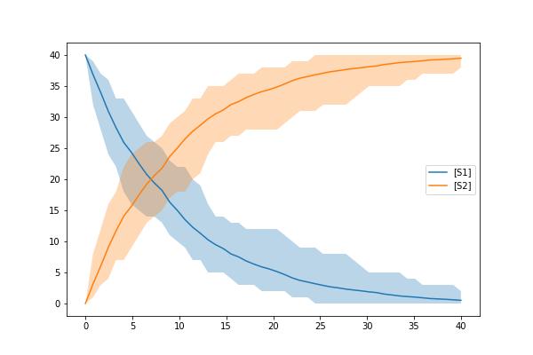
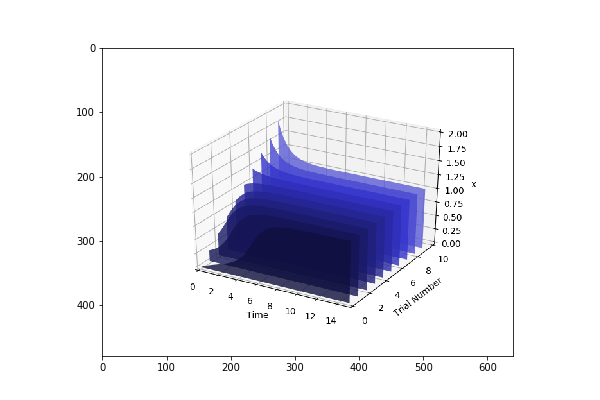
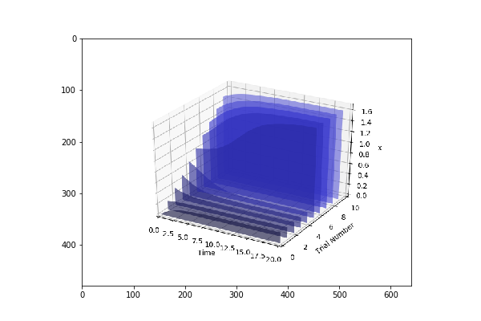

======================
Parallel Programming
======================

Tellurium in Distributed Environment
====================

Tellurium features a new functionality that can help users to perform simulation much faster. In the background it runs on a distributed cluster of machines and computations are done in-memory to achieve a very low latency. Currently, it allows users to run the computations/simulations with regards to parameter scans, parameter fitting, sensitivity analysis and parameter identifiability. `Apache Spark <https://spark.apache.org/>`_  has been integrated with Tellurium and this allow users to run different simulations parallelly.

To run this, first it is required to setup Spark Cluster on one ore more machines which follows Master-Slave architecture. Spark can run on Spark's Standalone, `Apache Mesos <http://mesos.apache.org/>`_ and `Hadoop YARN  <https://hadoop.apache.org/docs/current/hadoop-yarn/hadoop-yarn-site/YARN.html>`_. If you are a python lover, you are in garden. Run the below pip command to install spark in a single machine.

.. code-block:: python

    pip install pyspark
 
Or follow the instruction available in `Spark Downloads <https://spark.apache.org/downloads.html>`_ Page.

Getting Started
========================

First it is required to initialize spark context (sc) as this coordinates everything that needs to run parallelly. This is available in default if you open pyspark from terminal or through `Zeppelin <https://zeppelin.apache.org/>`_.

.. code-block:: python

    	from pyspark import SparkContext,SparkConf
	conf = SparkConf().setAppName('<APPLICATION_NAME>').setMaster('<SPARK_MASTER>')
	sc = SparkContext(conf=conf)

The two important things that needs to get replaced are <APPLICATION_NAME> which can be anything that a program can be named while the other thing is <SPARK_MASTER> which can be local[2] (Which means your application uses 2 threads and it can be any 'n' value) if you are running it on a single machine or it could be of the form spark://127.208.10.259:8000 assuming your spark master is on 8000 port and running on node with IP 127.208.10.259.

Your First Stochastic Simulation
========================

After the Spark Context is perfectly initialised, lets run our first simple stochastic simulation. 

.. code-block:: python

	import tellurium as te

	model_def = 'S1 -> S2; k1*S1; k1 = 0.1; S1 = 40'
	stochastic_simulation_model = te.StochasticSimulationModel(model=model_def,
	                seed=1234, # not used
	                variable_step_size = False,
	                from_time=0,
	                to_time=40,
	                step_points=50)
	stochastic_simulation_model.integrator = "gillespie"
	results = te.distributed_stochastic_simulation(sc,stochastic_simulation_model,50)
	te.plot_stochastic_result(results)

In the above example, we have created a model as an antimony string and then created a StochasticSimulationModel object with the parameters mentioned above. From the above example your model provided in the form of antimony string will simulate from 0 to 40 with 50 step points. You might see the result that looks like below

Parameter Estimation
========================

As a next example, you want to run Parameter Estimation for a specific set of attributes of your model(s). Additionally you may need to provide an optimization function so as to estimate values accurately. It begins with usual object creation of stochastic simulation model (Check the above code for reference)

Lets test Lotka Volterra Model and try estimating parameters in that model. We will use differential_evolution as an optimization function available in scipy library.

.. code-block:: python
	
	import tellurium as te
	from scipy.optimize import differential_evolution as diff_evol

Now we will initialise our Lotka-Volterra antimony model. 

.. code-block:: python

	# Load the Lotka-Volterra model
	lotka_volterra_antimony_model_definition = '''
	model *LVModel()
	  // Compartments and Species:
	  compartment compartment_;
	  species A in compartment_, B in compartment_;
	  // Reactions:
	  R1: A => 2A; compartment_*R1_k1*A;
	  R2: A => B; compartment_*A*B*R2_p;
	  R4: B => ; compartment_*R4_k1*B;
	  // Species initializations:
	  A = 71;
	  B = 79;
	  // Compartment initializations:
	  compartment_ = 1;
	  // Variable initializations:
	  R1_k1 = 0.5;
	  R2_p = 0.0025;
	  R4_k1 = 0.3;
	  // Other declarations:
	  const compartment_;
	  // Unit definitions:
	  unit volume = 1e-3 litre;
	  unit substance = item;
	end
	'''

We use the above initialisation in order to create a Stochastic Simulation Model

.. code-block:: python

	stochastic_simulation_model = te.StochasticSimulationModel(model=lotka_volterra_antimony_model_definition,
	                seed=1234, # not used
	                variable_step_size = False,
	                from_time=0,
	                to_time=1000,
	                step_points=1000)
	stochastic_simulation_model.integrator = "gillespie"

Defining the bounds of the parameters we wish to estimate

.. code-block:: python

	bounds = {"R1_k1":(0.0,1.0),"R4_k1":(0.0,0.5)}

If you wish to run it as a stochastic simulation with running number of simulation in a distributed enviroment.

.. code-block:: python
	
	from pyspark import SparkContext,SparkConf
	conf = SparkConf().setAppName('RunningMonteCluster').setMaster('SPARK_MASTER')
	sc = SparkContext(conf=conf)

Now, you just need to call run function to evaluate and estimate the parameters based on the bounds provided

.. code-block:: python
	
	parameter_est = te.ParameterEstimation(stochastic_simulation_model,bounds,stochastic=False, sc=None)
	path = "/home/shaik/year/stoch-param-fitting-benchmarks/zimmer/ID/"
	parameter_est.setDataFromFile(path+FILENAME)
	print parameter_est.run(diff_evol,maxiter=1)

Lets look into more Complex models using Stochastic Simulations

	
.. code-block:: python

	from scipy.optimize import differential_evolution as diff_evol
	stochastic_simulation_model = te.StochasticSimulationModel(model=antimony_model,
	                seed=1234, # not used
	                variable_step_size = False,
	                from_time=0,
	                to_time=1000,
	                step_points=1000)
	stochastic_simulation_model.integrator = "gillespie"

Here we are using differential evolution as optimization function and we are creating a stochastic simulation model providing antimony string as model along with necessary arguments. The next step would be providing parameters with their lower and upper bounds

.. code-block:: python

	bounds = {
	    "kdegMdm2":(0.0000001, 0.9),
	    "kdegp53":(0.0000001,0.9),
	    "kbinMdm2p53":(0.000001,9),
	    "krelMdm2p53":(0.00000001,0.09),
	    "kphosMdm2":(0.001,10000.0),
	    "kdephosMdm2":(0.0001,900),
	    "kdegATMMdm2":(0.0000001,0.9)
	}

Then to trigger Parameter Estimation we need to call ParameterEstimation from tellurium module.

.. code-block:: python

	parameter_est = te.ParameterEstimation(stochastic_simulation_model,bounds,stochastic=True, sc=sc)

The key points that we need to change here are 

- **stochastic**
Can be True/False. True will run stochastic simulation and get the mean of the results. It should be noted that sc which represents Spark Context should be provided if you need to set stochastic as True. If set to False, this will run in normal python without Spark and will perform only a sinle run.

- **sc**
This represents the Spark Context Object created. This is a mandatory argument when stochastic is True

.. code-block:: python

    	from pyspark import SparkContext,SparkConf
	conf = SparkConf().setAppName('<APPLICATION_NAME>').setMaster('<SPARK_MASTER>')
	sc = SparkContext(conf=conf)

After creating ParameterEstimation object we need to set the data which is compared against and then need to run.

.. code-block:: python

	parameter_est.setDataFromFile(path+FILENAME)
    	print parameter_est.run(diff_evol,maxiter=1)

In the above block we have configured our data using the setDataFromFile method which accepts FILEPATH as an argument. Then we performed **run** method which accepts the  optimization function along with the other arguments required for the optimization function. Your result structure may look similar to this.

.. code-block:: python

	{
		'Estimated Result': array([8.09843570e-04, 2.05751914e-05, 2.06783537e-03,4.93490582e-04]),
		'Average SSE': 9.2357328599694437,
		'Parameters': ['kdegp53', 'krelMdm2p53', 'kbinMdm2p53', 'kdegMdm2']
	} 

The results are in the form of numpy array along with Average SSE (Sum of Squared Errors) for the simulations. Here is the explanation of the mapping

- **kdegp53**     : 8.09843570e-04
- **krelMdm2p53** : 2.05751914e-05
- **kbinMdm2p53** : 2.06783537e-03
- **kdegMdm2**    : 4.93490582e-04
- **Average SSE** : 9.2357328599694437

Parameter Scanning
========================

With Distributed nature of tellurium, now you can run parameter scanning for multiple models. More work is currently in progress which enables user to store images in multiple formats and also in HDFS or any other file system.

.. code-block:: python

	model_one_road_runner = '''
	    J1: $Xo -> x; 0.1 + k1*x^2/(k2+x^3);
	    x -> $w; k3*x;

	    k1 = 0.9;
	    k2 = 0.3;
	    k3 = 0.7;
	    x = 0;
	'''

	model_two_road_runner = '''
	    J1: $Xo -> x; 0.1 + k1*x^4/(k2+x^4);
	    x -> $w; k3*x;

	    k1 = 0.8;
	    k2 = 0.7;
	    k3 = 0.5;
	    x = 0;
	'''

	model_one_parameters = {"startTime" : 0,"endTime" : 15,"numberOfPoints" : 50,"polyNumber" : 10,"endValue" : 1.8,"alpha" : 0.8,"value" : "x","selection" : "x","color" : ['#0F0F3D', '#141452', '#1A1A66', '#1F1F7A', '#24248F', '#2929A3','#2E2EB8', '#3333CC', '#4747D1', '#5C5CD6'] }

	model_two_parameters = {"startTime" : 0,"endTime" : 20,"numberOfPoints" : 60,"polyNumber" : 10,"endValue" : 1.5,"alpha" : 0.6,"value" : "x","selection" : "x","color" : ['#0F0F3D', '#141452', '#1A1A66', '#1F1F7A', '#24248F', '#2929A3','#2E2EB8', '#3333CC', '#4747D1', '#5C5CD6'] }

We have created two models and parameters separately and we are interested in running Parameter Scan for these models (it can be run for any number of models Parallelly), we wrap it an array and call distributed_parameter_scanning method.

.. code-block:: python

	plots = te.distributed_parameter_scanning(sc,[(model_one_road_runner,model_one_parameters),model_two_road_runner,model_two_parameters)],"plotPolyArray")

After the computation, plotting the results is easy

.. code-block:: python

	for fig in plots:
	    te.plotImage(fig)

You should see results similar to the ones below

Check this space for more information ...

 
