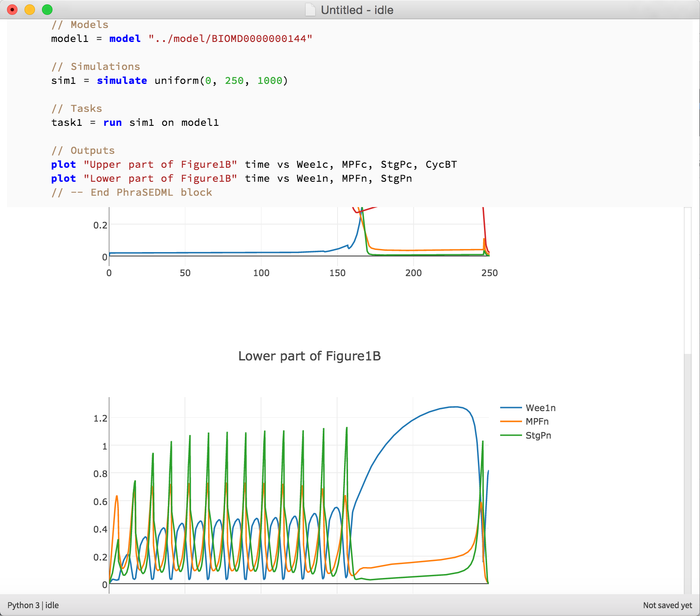
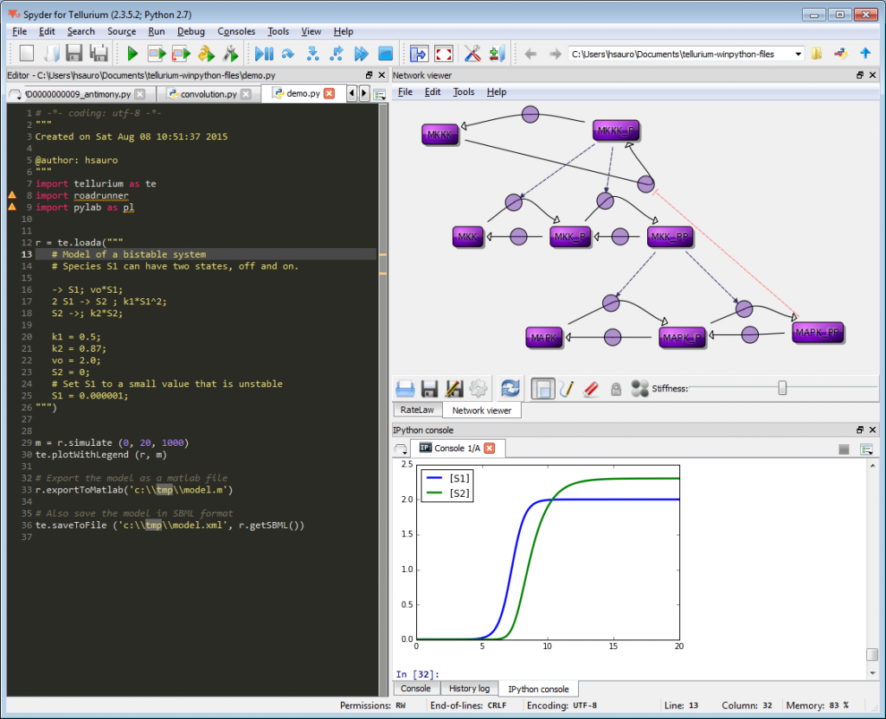

.. _front-ends::

======================
Installation and Front-ends
======================

---------------------
Installation Options
---------------------

Tellurium has several front-ends, and can also be installed as a collection of pip packages. We recommend a front-end for end-users who wish to use Tellurium for biological modeling, and the pip packages for developers of other software which uses or incorporates Tellurium.

Front-end 1: Tellurium Notebook
===============================

Tellurium's notebook front-end mixes code and narrative in a flowing, visual style. The Tellurium notebook will be familiar to users of Jupyter, Mathematica, and SAGE. However, unlike Jupyter, Tellurium notebook comes pre-packaged as an app for Windows, Mac, and Linux and does not require any command line installation. This front-end is based on the `nteract project <https://github.com/nteract/nteract>`_.

* Front-end: **Tellurium Notebook**
* Supported platforms: |billy| |jobsey| |benguin|
* Python version: 3.6, 64-bit
* **Download:** `here <https://github.com/sys-bio/tellurium#front-end-1-tellurium-notebook>`_

    Tellurium notebook offers an environment similar to Jupyter

Front-end 2: Tellurium IDE
==========================

User who are more familiar with MATLAB may prefer Tellurium's IDE interface, which is based on popular programming tools (Visual Studio, etc.). This front-end is based on the `Spyder project <https://www.spyder-ide.org/>`_. Due to stability issues, we recommend Mac users use the Tellurium notebook front-end instead.

* Front-end: **Tellurium IDE**
* Supported platforms: |billy2| |jobsey2| (no Mac updates)
* Python version: 2.7, 64-bit
* **Download:** `here <https://github.com/sys-bio/tellurium#front-end-2-tellurium-ide>`_

    Tellurium IDE features a programmer-centric interface similar to MATLAB

PyPI Packages
=============

Tellurium can be installed using the command line tool ``pip``.

* No front-end
* Supported platforms: |billy3| |jobsey3| |benguin3|
* Python version: 2.7, 3.4, 3.5, 3.6

.. code-block:: bash

    $ pip install tellurium

Supported Python Versions
=======================

The Tellurium PyPI packages support 64-bit Python versions 2.7, 3.4, 3.5, and 3.6 for Windows, Mac, and Linux. The notebook viewer comes with Python 3.6 (64-bit) and the IDE comes with Python 2.7 (32-bit). If you need support for a Python version not already covered, please `file an issue <https://github.com/sys-bio/tellurium/issues>`_.

