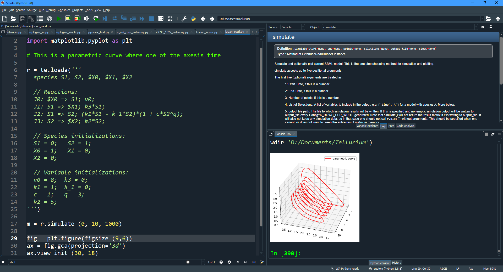

.. _front-ends::

===========================
Installation and Front-ends
===========================

* Supported platforms: |billy3| |jobsey3| |benguin3|

As of March 2021, we currently support Python 3.7, 3.8 and 3.9 for Windows, Mac and Linux.

If you need support for a Python version not already covered, please `file an issue <https://github.com/sys-bio/tellurium/issues>`_.

New versions of Tellurium no longer support Python 2.7. For those needing Python 2.7 access, previous versions of Tellurium can be installed. 

.. |billy| image:: ./images/windows.png
   :scale: 50%
   :target: https://github.com/sys-bio/tellurium#windows

.. |jobsey| image:: ./images/macos.png
   :scale: 50%
   :target: https://github.com/sys-bio/tellurium#mac-osx

.. |benguin| image:: ./images/linux.png
   :scale: 50%
   :target: https://github.com/sys-bio/tellurium#redhat

---------------------
Installation Options
---------------------

Tellurium can be used with variety of Python front-ends, for example Spyder, PyCharm, Visual Studio Code, Jupyter Notebooks and Jupyter Lab. For easy access on Windows we recommend the Windows installer. This will install the Spyder IDE as well as one click access to either Jupyter Notebook or Jupyter Lab. 

For Mac, Linux as well Windows platforms, Tellurium can be installed using a standard pip insall as a collection of pip packages: 

.. code-block:: bash

    $ pip install tellurium

For novice users we recommend the Windows Installer. This provdes everything you need and installation is like any other Windows application.

User who are more familiar with MATLAB may prefer the Spyder interface `Spyder project <https://www.spyder-ide.org/>`_ that comes with the Windows installer and is available on other platforms via Anaconda. 

The image below shows Telluirum running on the Spyder Python interface.

* Front-end: **Tellurium using Spyder IDE**
* Supported platforms: |billy| |jobsey| |benguin|
* Python version: 3.7, 3.8, 3.9 64-bit
* **Download:** `here <https://github.com/sys-bio/tellurium#front-end-1-tellurium-notebook>`_

It's also possible to run Tellurium on the popular Jupyter notebook interface or Jupyter Lab. This can be accessed from colab, NanoHub and can also be installed on hosting systems such as binder. 

* Front-end: **Tellurium Using CoLab**
* Supported platforms: |billy2| |jobsey2| (no Mac updates)
* Python version: 3.8, 3.9, 64-bit
* **Download:** `here <https://github.com/sys-bio/tellurium#front-end-2-tellurium-ide>`_

.. figure:: ./images/tellurium_screenshot2.png
    :align: center
    :alt: Tellurium IDE screenshot
    :figclass: align-center
    :target: https://github.com/sys-bio/tellurium#front-end-2-tellurium-ide

    Tellurium IDE features a programmer-centric interface similar to MATLAB

