===========
Walkthrough
===========

Notebook Walkthrough
====================

If you have not already done so, download and install the `Tellurium notebook front-end <https://github.com/sys-bio/tellurium#front-end-1-tellurium-notebook>`_ for your platform (Windows, Mac, and Linux supported).

Basics
~~~~~~

The notebook environment allows you to mix Python code, narrative, and exchangeable standards for models and simulations. When you first open the notebook, you will have a single Python cell. You can type Python code into this cell. To run the code:

* Press ``shift+Enter``,
* Click the play button at the upper right of the cell, or
* Choose ``Cell`` -> ``Run All`` from the menu.

The output of running the cell will be shown beneath the cell.

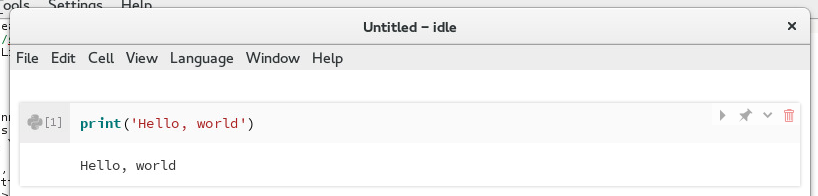

    Output of running a Python cell

Creating Cells
~~~~~~~~~~~~~~

You can add new cells by moving your cursor past the last cell in the notebook. You should see a menu with three options: ``New``, ``Import``, and ``Merge``. Choose ``New`` to create a new cell. You will see four choices:

* New Python Cell
* New Markdown Cell (for creating narrative)
* New Model Cell (for SBML/Antimony models)
* New OMEX Cell (for COMBINE archives)

For now, select ``New Markdown Cell``. Markdown cells allow you to place formatted text and hyperlinks in your notebook. For a review of Markdown syntax, please see `this reference <https://guides.github.com/features/mastering-markdown/>`_.

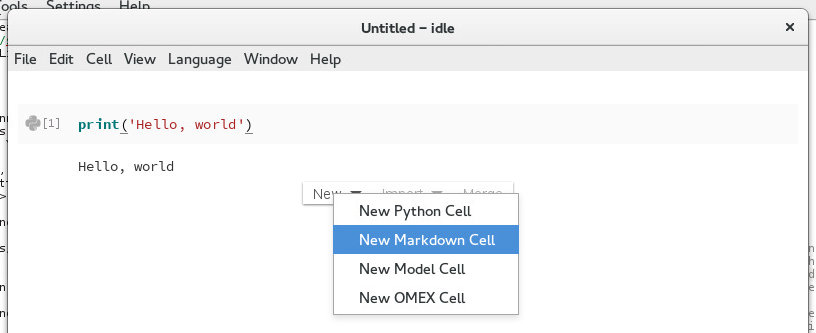

    Creating a new Markdown cell

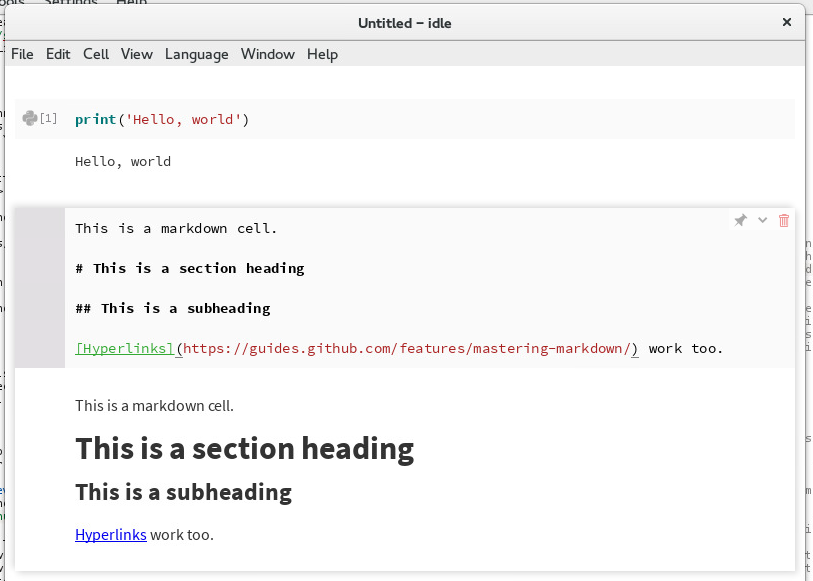

    Editing a Markdown cell

SBML Cells
~~~~~~~~~~

Unlike vanilla Jupyter, Tellurium allows you embed a human-readable representation of SBML directly in your notebook. To begin, first download the `SBML for the represillator circuit from BioModels <https://www.ebi.ac.uk/biomodels-main/download?mid=BIOMD0000000012>`_. Then, in the Tellurium notebook viewer, move your cursor past the last cell in the notebook and select ``Import`` -> ``Import SBML...``.

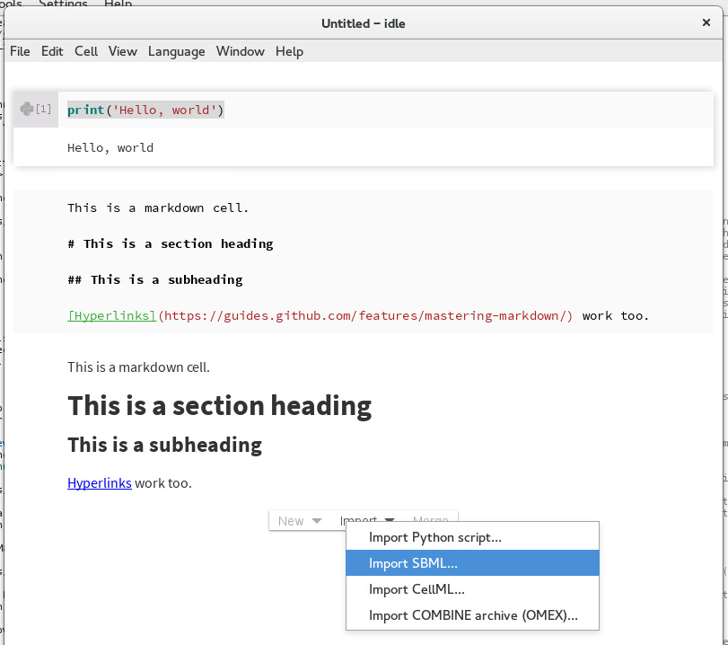

    Importing an SBML model

Navigate to the ``BIOMD0000000012.xml`` file that you downloaded and select it. A new cell will be created in the notebook with a human-readable representation of this model. The human-readable syntax is called Antimony, and you can find an `extensive reference on the syntax here <http://tellurium.readthedocs.io/en/latest/antimony.html>`_. For now, just change the name of the model from ``BIOMD0000000012`` to ``repressilator``.

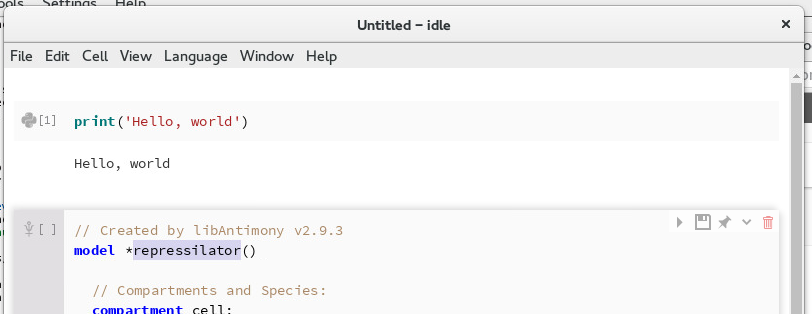

    Changing the name of the model

Now, run the cell. You should see confirmation that the model was correctly loaded and is available under the variable ``repressilator`` in Python.

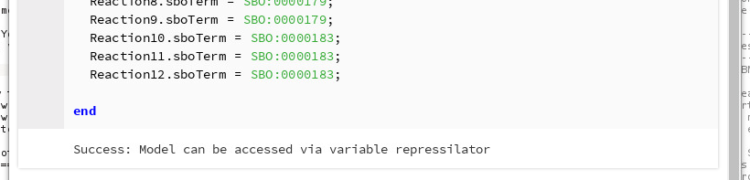

    Running the SBML cell

After the SBML cell, create a Python cell with the following content:

.. code-block:: python

    repressilator.reset() # in case you run the cell again
    repressilator.simulate(0,1000,1000) # simulate from time 0 to 1000 with 1000 points
    repressilator.plot() # plot the simulation

After you run this cell, you should see the following simulation plot:

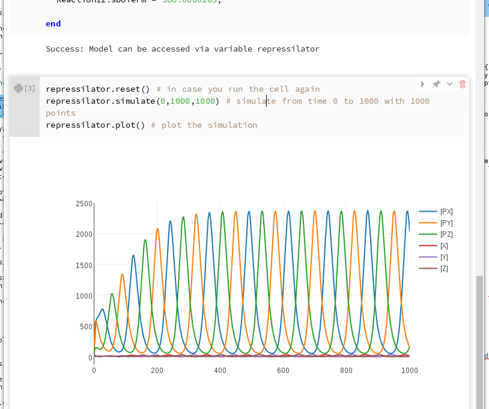

    Simulating the SBML model

The ``repressilator`` variable is actually an instance of the `RoadRunner simulator <http://libroadrunner.org/>`_. Please see the `official documentation for libRoadRunner <http://sys-bio.github.io/roadrunner/python_docs/index.html>`_ for an extensive list of methods and options that can be used with RoadRunner.

You can also use ``ctrl+Space`` to open the auto-completion menu for a variable defined in a previous cell. This also goes for variables such as ``repressilator`` defined in SBML cells.

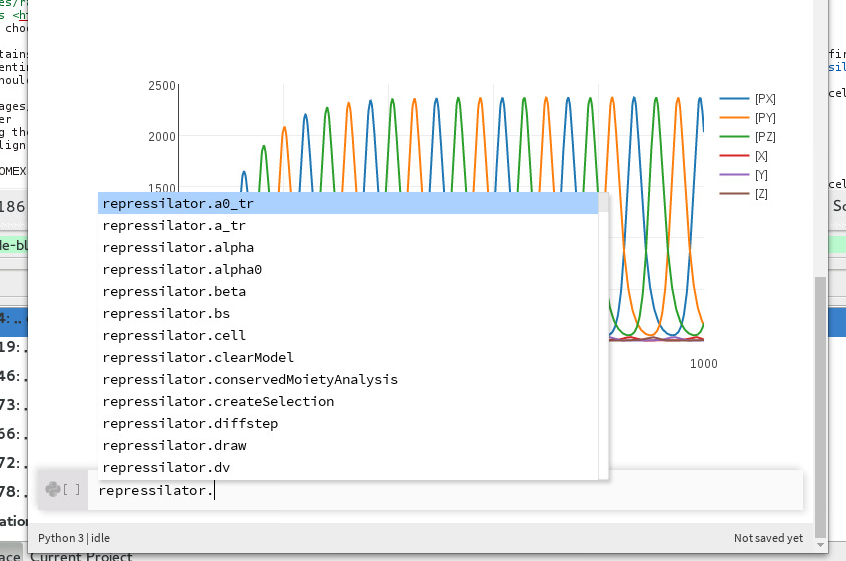

    Showing all auto-completions for the repressilator RoadRunner instance

COMBINE Archive Cells
~~~~~~~~~~~~~~~~~~~~~

Another name for COMBINE archives is the Open Modeling and EXchange format (OMEX), which shows up in various Tellurium menus and functions. COMBINE archives are containers for various community standards in systems biology. They can contain `SBML <http://sbml.org/Main_Page>`_, `SED-ML <https://sed-ml.github.io/>`_, `CellML <https://www.cellml.org/>`_, and `NeuroML <https://www.neuroml.org/>`_. Tellurium supports importing COMBINE archives containing SBML and SED-ML.

To begin, download `this COMBINE archive <https://github.com/0u812/tellurium-combine-archive-test-cases/raw/master/swt/pulse_experiment.omex>`_ example (originally from the `SED-ML Web Tools <http://sysbioapps.dyndns.org/SED-ML_Web_Tools>`_). In the Tellurium notebook viewer, move the mouse past the last cell until the Cell Creator Bar appears and choose ``Import`` -> ``Import COMBINE archive (OMEX)...``.

This archive contains an SBML model and a SED-ML simulation. The simulation has a forcing function (representing external input to the system) in the form of a pulse. After running this cell, you should see the following output:

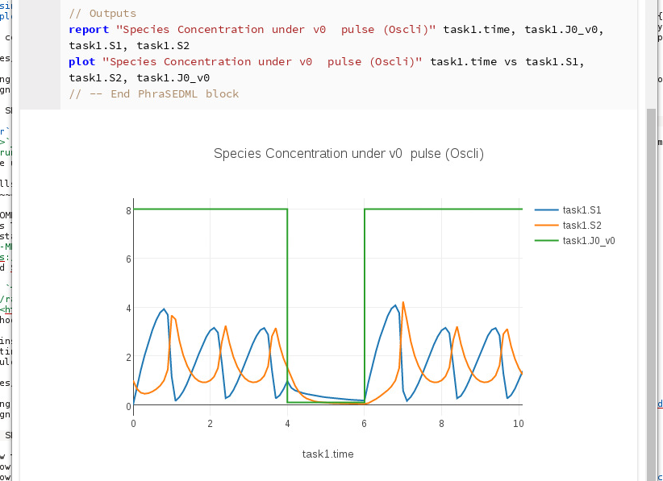

    Running the OMEX cell

As a demo of Tellurium's COMBINE archive editing functionality, we can change the duration of the pulse. Change the following line:

::

    task1 = repeat task0 for local.index in uniform(0, 10, 100), local.current = index -> piecewise(8, index < 1, 0.1, (index >= 4) && (index < 6), 8), model1.J0_v0 = current : current

To:

::

    task1 = repeat task0 for local.index in uniform(0, 10, 100), local.current = index -> piecewise(8, index < 1, 0.1, (index >= 4) && (index < 10), 8), model1.J0_v0 = current : current

In other words, ``index < 6`` was changed to ``index < 10``. Run the cell:

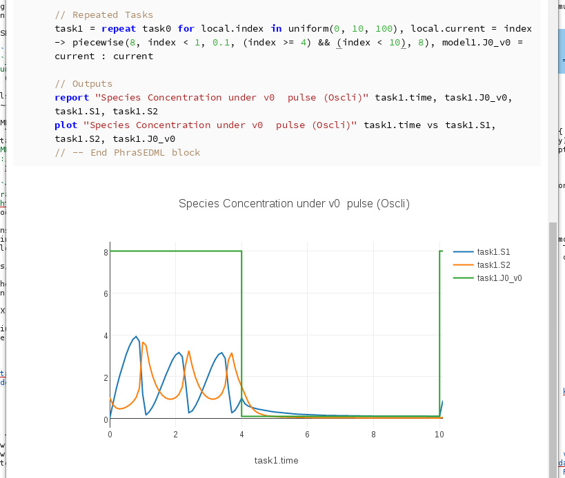

    Editing the OMEX cell

You can re-export this cell to a COMBINE archive by clicking the diskette icon in the upper right:

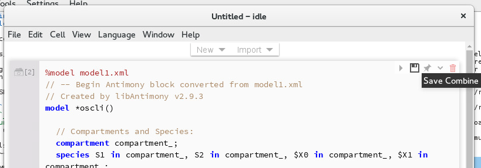

    Exporting the COMBINE archive

Find/Replace in Notebook Cells
~~~~~~~~~~~~~~~~~~~~~~~~~~~~~~

To search for text in a notebook cell, use ``ctrl+F``. To search for whole-words only, use ``/\bmyword\b`` where ``myword`` is the word you want to search for.

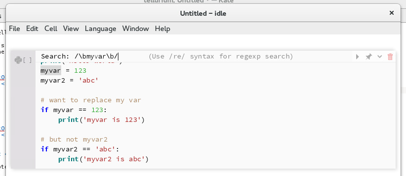

    Searching for whole words

To search and replace, use ``ctrl+shift+R``. For example, to replace ``myvar`` but not ``myvar2`` (i.e. whole-word search & replace) in the code below, press ``ctrl+shift+R``, enter ``/\bmyvar\b/`` for the search field and ``newvar`` for the replace field. The result is that all instances of ``myvar`` are replaced, but not ``myvar2``:

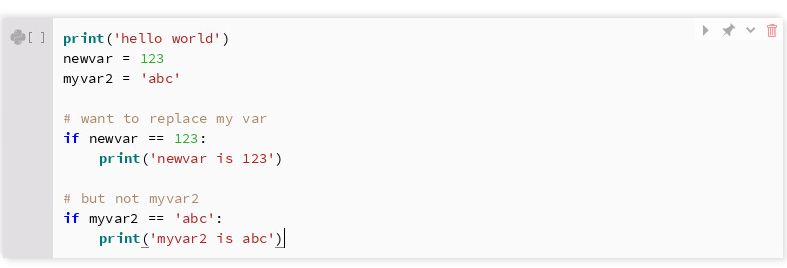

    Search & replace demo with whole words

Example Notebooks
~~~~~~~~~~~~~~~~~

Tellurium comes with many example notebooks showing how to use its various features. To access these notebooks, use the ``File`` -> ``Open Example Notebook`` menu. Tellurium comes with five example notebooks:

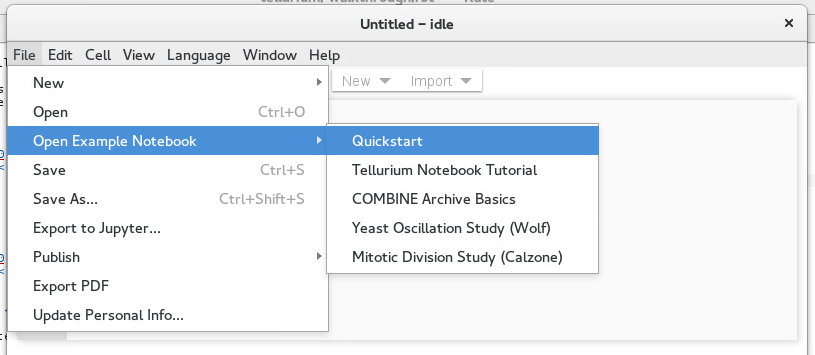

    Opening example notebooks

The **Quickstart** notebook contains the `Quickstart <http://tellurium.readthedocs.io/en/latest/quickstart.html>`_ example from this documentation, using the SBML cells of the Tellurium notebook viewer.

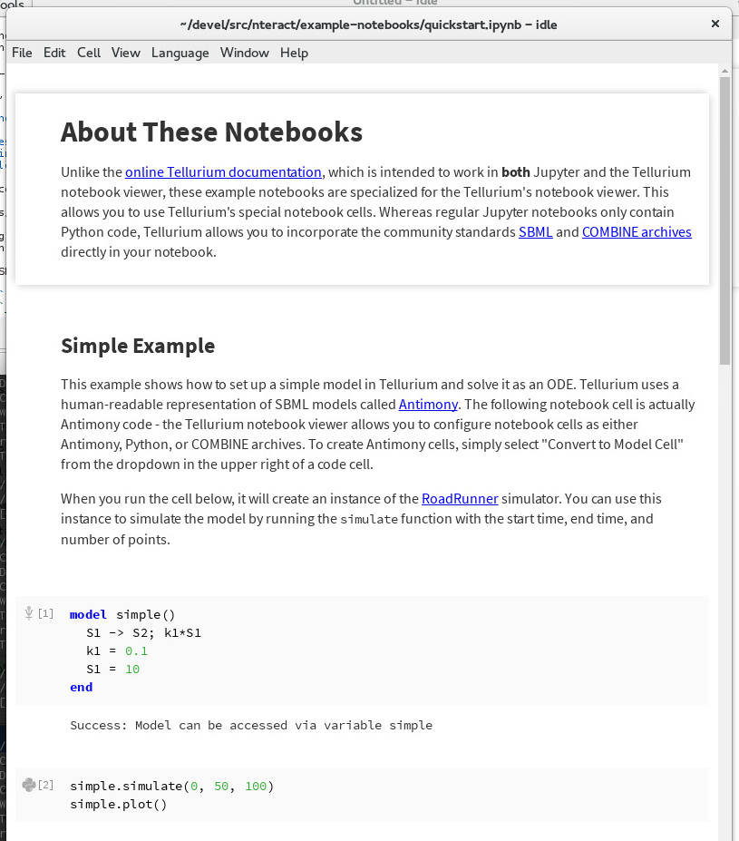

    Quickstart example notebook

Exporting to Jupyter
~~~~~~~~~~~~~~~~~~~~

Tellurium notebooks can contain special cell types such as the SBML or OMEX cells described above. These notebooks cannot be properly read by Jupyter. However, you can export these notebooks to Jupyter by choosing ``File`` -> ``Export to Jupyter...`` from the menu. You will notice that the exported notebooks contain special cell magics such as ``%%crn`` and ``%%omex``. To run these notebooks in Jupyter, install the ``temagics`` package in addition to ``tellurium`` using pip.

Advanced Topics
===============

.. _other-kernels:

Using Other Jupyter Kernels / Languages
~~~~~~~~~~~~~~~~~~~~~~~~~~~~~~~~~~~~~~~

A built-in Python 3 kernel is provided with the notebook app. However, there are cases where this is not enough. Tellurium owes its existance in part to great free / open-source projects like `nteract <https://nteract.io/desktop>`_. We recommend anyone interest in a general-purpose notebook environment `consider nteract instead <https://nteract.io/desktop>`_.

Nevertheless, sometimes using a kernel other than the built-in Python 3 kernel is necessary. Starting with version 2.0.14, Tellurium supports automated discovery of other Jupyter kernels, such as different Python versions and distributions (e.g. Anaconda) and other languages (the Tellurium packages are not available in other languages). The following example shows how to use an `R <https://www.r-project.org/>`_ kernel with Tellurium.

* First, follow the installation instructions for the `IRkernel <https://github.com/IRkernel/IRkernel>`_ (`see also <https://irkernel.github.io/installation/>`_). These instructions use R 3.3.0. The following procedure for installing the IRkernel works for us:

.. code-block:: r

    install.packages('devtools')
    install.packages(c('repr', 'IRdisplay', 'evaluate', 'crayon', 'pbdZMQ', 'devtools', 'uuid', 'digest'))
    devtools::install_github('IRkernel/IRkernel')

* Make sure the IRkernel is registered:

.. code-block:: r

    IRkernel::installspec()

* Start the Tellurium notebook app. Under the ``Language`` menu, select ``Find Kernels...``. A pop-up with a ``Scan`` button should appear. Click the ``Scan`` button. The results of the scan show all the kernels available to Tellurium. The built-in Python 3 and Node.js kernels are always available. Additional kernels appear based on installed Jupyter kernels. If you don't see a Jupyter kernel you want here, make sure you have correctly installed the kernel (each his its own set of instructions). If the kernel still does not show up, make sure it is a true Jupyter kernel. Older IPython-based kernels (i.e. kernels which install under ``~/.ipython`` instead of ``~/.jupyter``) cannot be discovered by Tellurium.

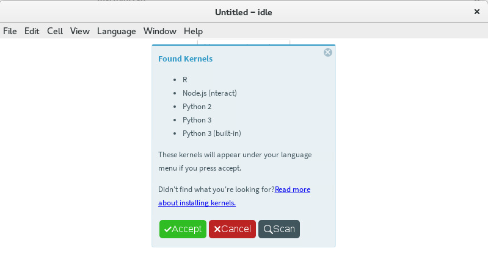

    Displaying the available kernels after a scan

* Sometimes the path to a kernel's executable can be displayed by hovering over the kernel's name. The R kernel you installed should appear in the list. Click the accept button to cause the ``Language`` menu to be updated with the new kernel choices.

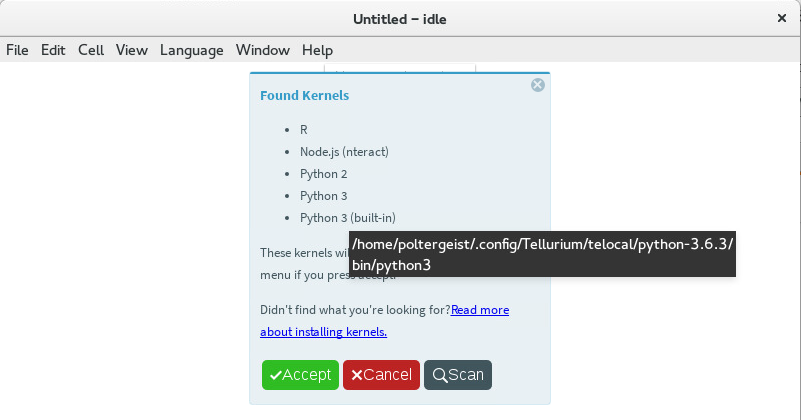

    Hover over the name of a kernel to display its path

* By selecting ``Language`` -> ``R``, you can cause the notebook to switch to the IRkernel. All code cells will be interpreted as R (SBML and OMEX cells will not work).

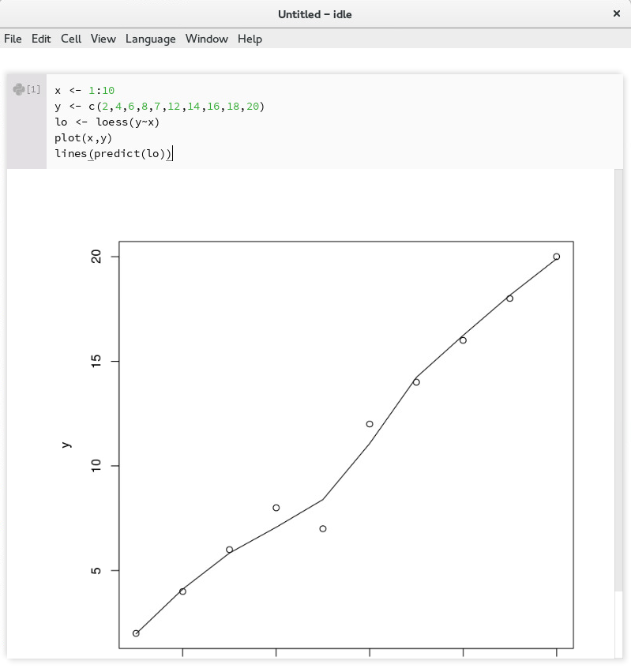

    Demo of running an R kernel in Tellurium

--------------------------------

Notebook Troubleshooting
========================

Problem: Cannot Load Kernel
~~~~~~~~~~~~~~~~~~~~~~~~~~~

The notebook viewer ships with a Python3 kernel, which causes problems when trying to open a notebook saved (e.g. by Jupyter) with Python2.

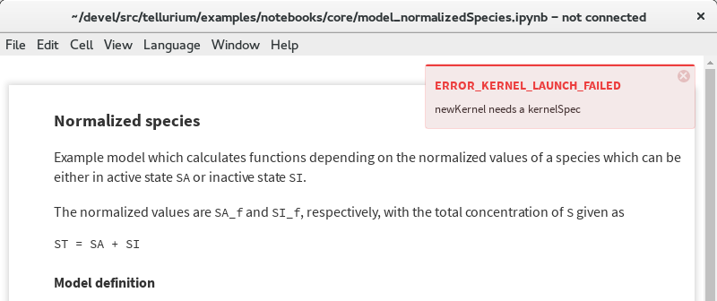

    Error message when kernel cannot be loaded

Solution
~~~~~~~~

In such a case, simply replace the kernel by choosing ``Language`` -> ``Python 3`` from the menu.

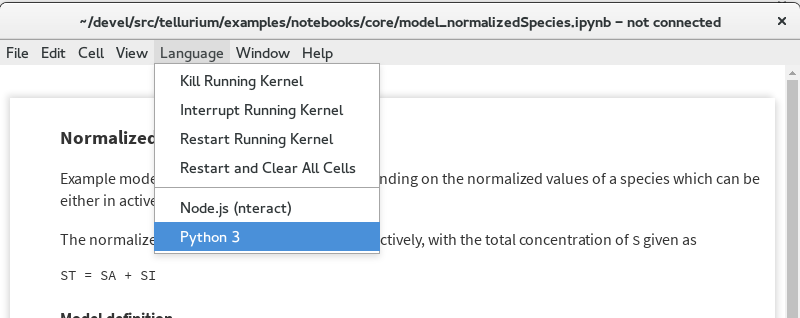

    Fix for kernel loading problem

Problem: Saving the Notebook Takes Forever
~~~~~~~~~~~~~~~~~~~~~~~~~~~~~~~~~~~~~~~~~~

Solution
~~~~~~~~

When highly detailed / numerous plots are present, Plotly is known to slow down notebook saving. In such cases, you can switch to matplotlib instead of Plotly by calling ``import tellurium as te; te.setDefaultPlottingEngine('matplotlib')`` at the beginning of your notebook. When using matplotlib for plotting, the long save times do not occur.

Alternatively, choose ``Language`` -> ``Restart and Clear All Cells`` to save the notebook without output.

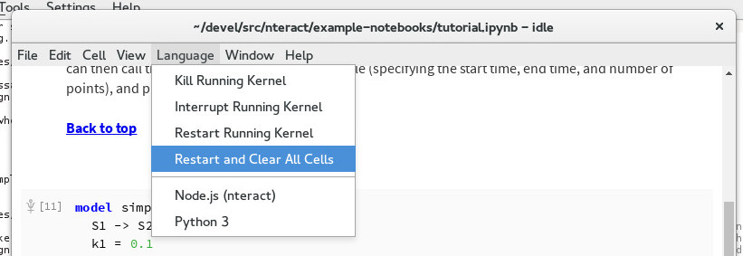

    Reset and clear all cells

---------------------------------

Further Reading
===============

* Tellurium notebook is based on the `nteract app <https://blog.nteract.io/nteract-revolutionizing-the-notebook-experience-d106ca5d2c38>`_.
* `Jupyter. <http://jupyter.org/>`_

------------

IDE Walkthrough
====================

If you have not already done so, download and install the `Tellurium Spyder IDE front-end <https://github.com/sys-bio/tellurium#front-end-2-tellurium-spyder-ide>`_ for your platform (only for Windows, legacy versions supported Mac).

Basics
~~~~~~

Tellurium Spyder is based on Spyder IDE, a popular open-source integrated development environment for Python. Tellurium Spyder offers experience akin to MATLAB, allowing you to view, edit, and execute Python scripts through dedicated editor and console windows. Addtionally, Tellurium Spyder comes with various tools to help you code. When you first open Tellurium Spyder, you will be greeted by an editor pane with example script, an IPython console, and a Help pane. You can execute the script in the editor pane directly on the IPython console by:

* Pressing the green arrow
* Pressing ``F5``
* Pressing ``Run`` -> ``Run``

The example script contains an oscillation model. When you run the script, a plot will appear in the IPython console as the output.

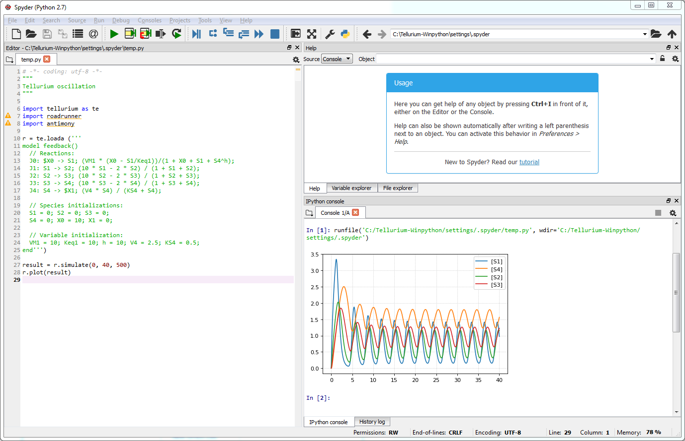

    Output of running the example script

For more information on how to build and simulate a model, check `Quick Start <https://tellurium.readthedocs.io/en/latest/quickstart.html>`_  and   `libRoadRunner Tutorial <https://sys-bio.github.io/roadrunner/python_docs/using_roadrunner.html>`_.

Creating and Running Cells
~~~~~~~~~~~~~~~~~~~~~~~~~~

Similar to Jupyter notebook, Spyder IDE allows you to create cells. To create a cell, simply put ``#%%`` in the script. Each ``#%%`` will signal generation of a new cell. To run a cell, press ``shift+enter`` while in focus of a cell. If you want to run only part of a script, you can do it by drag-selecting the part and pressing ``F9``.

Importing Files
~~~~~~~~~~~~~~~

Tellurium Spyder comes with few plugins to help you import SBML, SED-ML, and COMBINE archives. Under ``File`` menu, press ``Open SBML file`` to open an SBML file and automatically translate it into Antimony string in a new editor tab. To import SED-ML or COMBINE archive, go to ``File`` -> ``Import``. You can import SED-ML or COMBINE archive using either phraSED-ML notation or raw Python output. Tellurium understands phraSED-ML notation. 

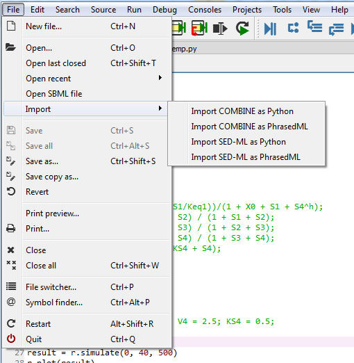

    Importing SBML, SED-ML, and COMBINE archives

RateLaw Plugin
~~~~~~~~~~~~~~

Tellurium Spyder comes with RateLaw plugin. RateLaw plugin contains a list of various rate laws and allows users to insert rate laws directly to the editor. Simply put, it is a dictionary of rate laws so that you don't have to memorize it. To use it, go to ``Tools`` -> ``Rate Law Library``. You can then choose a rate law, fill in the parameters if you wish, and press ``Insert Rate Law``.

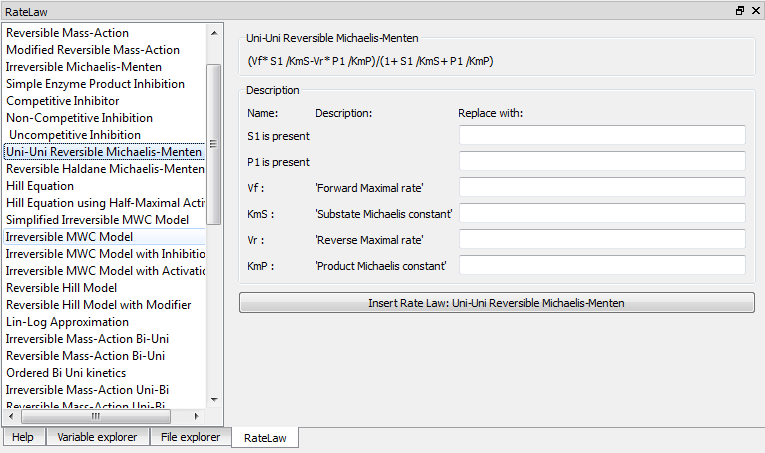

    RateLaw Plugin
    
Spyder Tips
~~~~~~~~~~~    
    
Both the editor and console window support tab completion. If you are looking for certain functions under a module or a class, simply press ``tab``. 

Spyder IDE also supports various ways to check the documentations. If you wish to know more about a function, press ``ctrl+i`` while the cursur is next to the function to pull up the documentation in the Help window or execute ``help(<function>)`` in IPython console. You can also use ``<function>?`` to know more about the object itself. IPython offers various IPython-specific magic commends. Check it out by running ``?`` without any arguments in the IPython console.

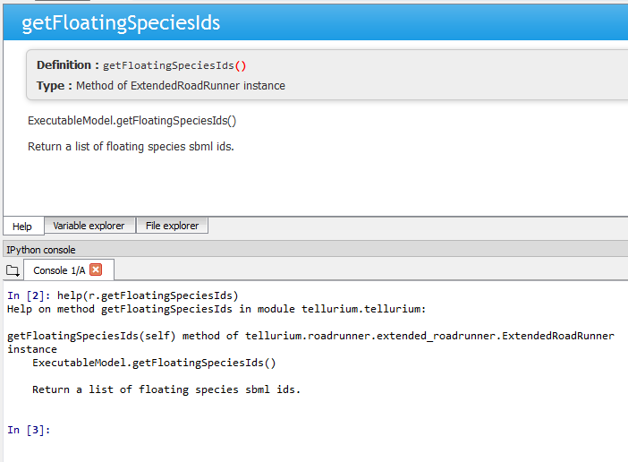

    Pulling documentation in the Help window or through IPython console.
    
Sometimes, IPython console might crash. Sometimes, you might want to restart the console to free up some memory. Yes, these things happen unfortunately. To researt the console, simply press ``ctrl+.`` in the console or ``right click -> Restart kernel``. While doing so, you might notice that you can open another IPython console as well. 

Further Reading
---------------

* `Official Spyder documentation <https://docs.spyder-ide.org/>`_

Advanced Topics on Tellurium Spyder
===================================

Running Jupyter Notebook
~~~~~~~~~~~~~~~~~~~~~~~~

Tellurium Spyder comes with Jupyter Notebook by default. To run it, go to ``Start Menu`` -> ``Tellurium Winpython`` -> ``Launch Jupyter Notebook`` or go to Tellurium Spyder installation directory and run ``Jupyter Notebook.exe``.

Running Command Prompt for Tellurium Spyder
~~~~~~~~~~~~~~~~~~~~~~~~~~~~~~~~~~~~~~~~~~~

Sometimes, you might want to run a Windows command prompt with the Python that comes with Tellurium Spyder as the default Python distribution. This can be useful if you wish to install addtional Python packages with more control. To do so, go to ``Start Menu`` -> ``Tellurium Winpython`` -> ``WinPython Command Prompt`` or go to Tellurium Spyder installation directory and run ``WinPython Command Prompt.exe``.

Tellurium Spyder Troubleshooting
================================

Problem: IPython Console Crashed
~~~~~~~~~~~~~~~~~~~~~~~~~~~~~~~~

When this happens, IPython will automatically recover most of the times. If it does not, manually restart the IPython console using ``ctrl+.`` or ``right click -> Restart kernel``.

Problem: Cannot Open Tellruim Spyder
~~~~~~~~~~~~~~~~~~~~~~~~~~~~~~~~~~~~

When Spyder IDE crashes, it will automatically try to recover on the next execution. However, if this does not happen, manually run the reset script. To do so, go to ``Start Menu`` -> ``Tellurium Winpython`` -> ``Reset Spyder`` or go to Tellurium Spyder installation directory and run ``Spyder reset.exe``. If Spyder still does not open, we suggest you to clean re-install Tellurium Spyder.

------------

Additional Resources for Tellurium
==================================

* `Suggest a new feature for Tellurium with UserVoice. <http://sysbio.uservoice.com/>`_
* `Herbert Sauro's modeling textbook <http://tellurium.analogmachine.org/new-modeling-text-book/>`_, which uses Tellurium
* `YouTube video tutorials <https://www.youtube.com/channel/UCpNSURm4YWe7sF0561mcvkg>`_ (made prior to Tellurium notebook).

Learning Python
===============

* `Google's Python class. <https://developers.google.com/edu/python/>`_
* Official tutorial for `Python 2 <https://docs.python.org/2/tutorial/>`_ and `Python 3 <https://docs.python.org/3/tutorial/>`_.
